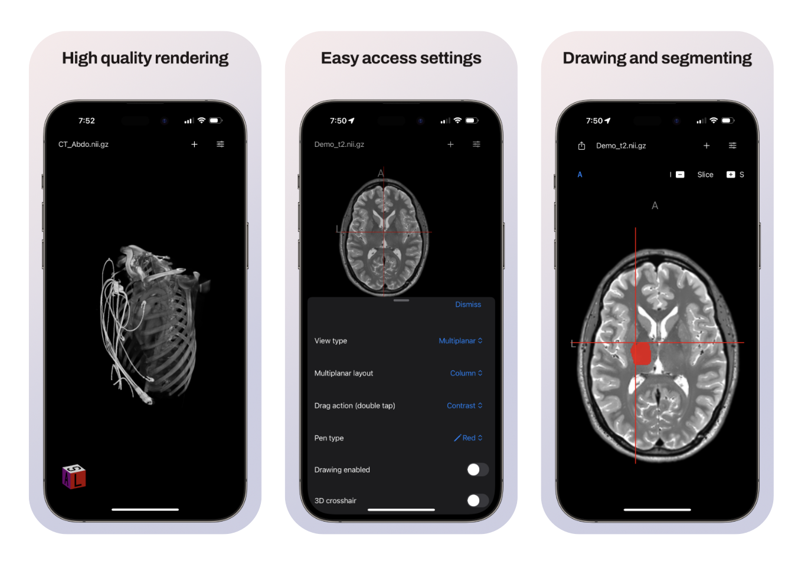
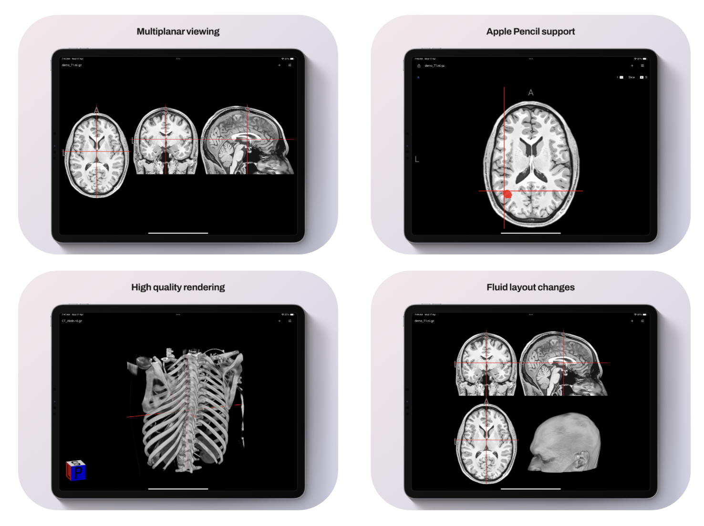
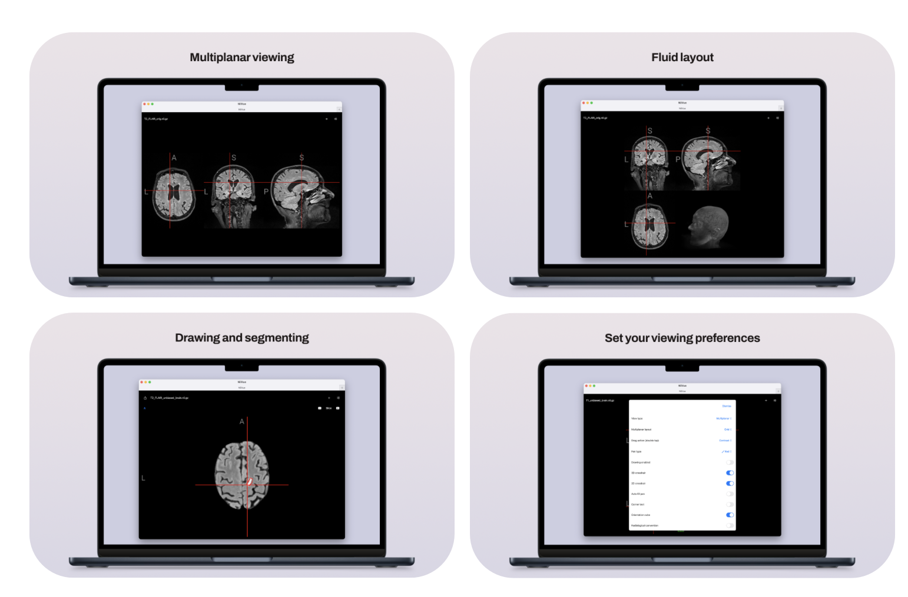

# Niivue iOS

The Niivue iOS applications allow users to view, draw, and segment medical images in formats commonly used in medical research. 

The native components of the application are written in Swift, and the medical images are rendered using Niivue in a web view.

## Features

- View MRI/CT images in common formats used in medical research
- Draw and segment images (Apple Pencil is supported as a touch device)
- Save and load images from the local device (no data is sent to a server)
- Works in Airplane mode
- Customise viewing optons (e.g. window/level, zoom/pan, etc.)
- Multiple layouts supported
- Save drawings to Files app on iPhone/iPad

## macOS support

The Niivue iOS application is is primarily designed for iPhone and iPad, but it can also be run on macOS as long as the macOS machine has an Apple Silicon chip (ARM).

# App screenshots

## iPhone

# iPad

# MacOS

## Development - Getting Started

TBD