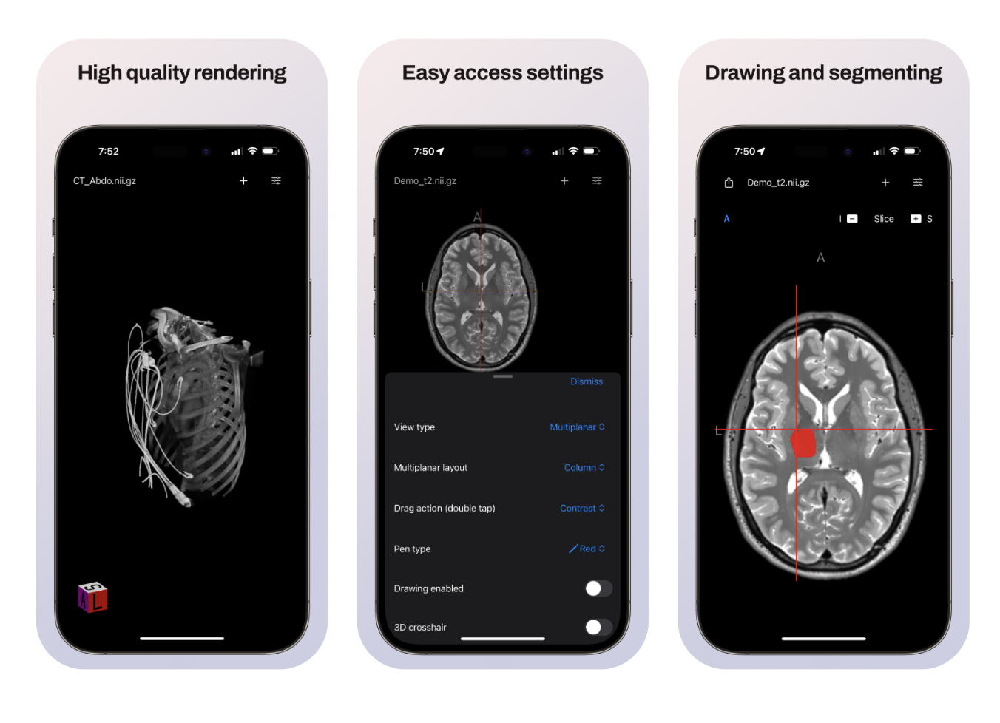
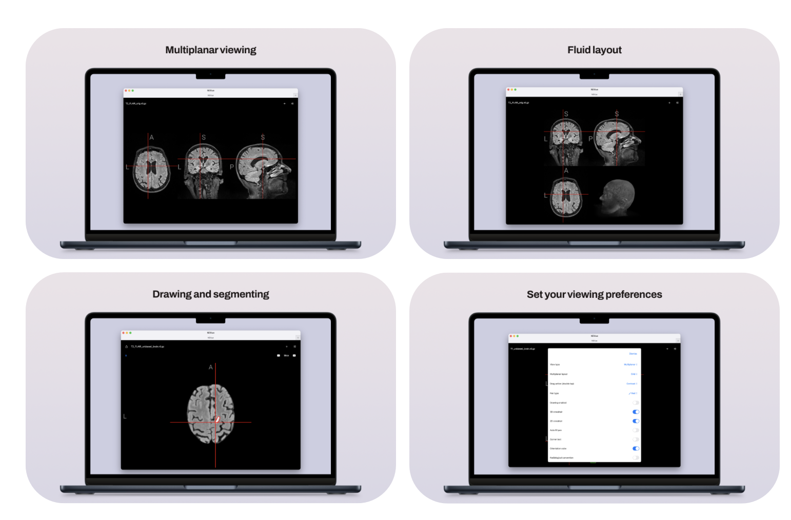

# Niivue iOS

The Niivue iOS applications allow users to view, draw, and segment medical images in formats commonly used in medical research. 

The native components of the application are written in Swift, and the medical images are rendered using Niivue in a web view.

## Features

- View MRI/CT images in common formats used in medical research
- Draw and segment images (Apple Pencil is supported as a touch device)
- Open images from the local device (no data is sent to a server)
- Works in Airplane mode
- Customise viewing options (e.g. window/level, zoom/pan, etc.)
- Multiple layouts supported
- Save drawings wherever you choose — the Files "Save to" sheet on iPhone/iPad,
  a real `NSSavePanel` on macOS
- A bundled demo volume (`T1w_DEMO.nii.gz`) loads automatically at launch

## macOS support

The app is primarily designed for iPhone and iPad, but it also builds and runs on
macOS as a **Mac Catalyst** app (`SUPPORTS_MACCATALYST = YES`). Catalyst gives a
resizable window and a real menu bar, and the iOS document picker becomes a native
`NSOpenPanel`.

## App screenshots

## iPhone


## iPad


## macOS


## Development - Getting Started

The app is a SwiftUI shell around a `WKWebView` that renders with
[NiiVue](https://github.com/niivue/niivue). The web viewer lives in
[`NiiVue/React`](NiiVue/React) and is documented in its own
[README](NiiVue/React/README.md).

### Requirements

- **Xcode** with the iOS platform *and* a simulator runtime installed
  (`xcodebuild -downloadPlatform iOS`). Without a runtime, `actool` fails with
  `No available simulator runtimes`.
- **Node.js 20.19+, 22.13+, or 24+**. Vite 8 needs `^20.19.0 || >=22.12.0`;
  ESLint 10 is the stricter one at `^20.19.0 || ^22.13.0 || >=24`.

`DEVELOPMENT_TEAM = VJ2G5D3BY7` is hardcoded in the project. Simulator builds sign
locally and ignore it; building for a device means changing it to your own team.

### Building

**The web viewer.** `React/dist` and `node_modules` are gitignored, so a fresh
clone needs a build before anything can run:

```bash
cd NiiVue/React
npm ci
npm run build     # tsc -b && vite build -> NiiVue/React/dist, which the app bundles
npm run lint      # optional
```

An Xcode build phase runs this for you (including `npm ci` when
`node_modules` is missing), so opening `NiiVue/NiiVue.xcodeproj` and hitting Run
is enough. Running it by hand is still the fastest way to see TypeScript or lint
errors without waiting on a full Xcode build.

**The app.** Open `NiiVue/NiiVue.xcodeproj` and run, or from the command line:

```bash
cd NiiVue

# iOS simulator
xcodebuild -project NiiVue.xcodeproj -scheme NiiVue \
  -destination 'platform=iOS Simulator,name=iPhone 17' build

# macOS (Mac Catalyst) — signed to run locally, see note below
xcodebuild -project NiiVue.xcodeproj -scheme NiiVue \
  -destination 'platform=macOS,variant=Mac Catalyst,arch=arm64' \
  CODE_SIGN_IDENTITY="-" CODE_SIGN_STYLE=Manual DEVELOPMENT_TEAM="" build
```

### Running

In Xcode, pick a destination from the toolbar and press Run. From the command
line, the builds above land in `DerivedData`; `-derivedDataPath` puts them
somewhere predictable instead.

**iOS Simulator** — boot a device, install, launch:

```bash
cd NiiVue
xcodebuild -project NiiVue.xcodeproj -scheme NiiVue \
  -destination 'platform=iOS Simulator,name=iPhone 17' \
  -derivedDataPath /tmp/nv build

xcrun simctl boot "iPhone 17"          # skip if already booted
open -a Simulator                       # bring the window up
xcrun simctl install booted /tmp/nv/Build/Products/Debug-iphonesimulator/NiiVue.app
xcrun simctl launch booted com.niivue.mobile
```

Useful while iterating:

```bash
xcrun simctl io booted screenshot shot.png   # capture the screen
xcrun simctl terminate booted com.niivue.mobile
xcrun simctl list devices available           # what you can boot
```

**macOS (Mac Catalyst)** — the build produces a normal `.app`:

```bash
cd NiiVue
xcodebuild -project NiiVue.xcodeproj -scheme NiiVue \
  -destination 'platform=macOS,variant=Mac Catalyst,arch=arm64' \
  -derivedDataPath /tmp/nv-mac \
  CODE_SIGN_IDENTITY="-" CODE_SIGN_STYLE=Manual DEVELOPMENT_TEAM="" build

open /tmp/nv-mac/Build/Products/Debug-maccatalyst/NiiVue.app
```

**iOS device** — needs a development certificate for your team; see *Signing*
below. Connect the device, then `xcrun devicectl list devices` to find it and use
its UDID as the destination `id`, or just use Xcode's Run button.

Either way the app opens on the bundled demo volume; the **+** button opens the
document picker. It is deliberately unfiltered — NiiVue reads NIfTI plus mgh/mgz,
nrrd/nhdr, mha/mhd, mif/mih, AFNI, npy/npz, vmr/v16, src, fib, ecat and more, and
almost none of those have a registered system UTI — so a file the renderer rejects
raises a named alert rather than being greyed out in the picker.

**Signing.** To see which certificates this Mac holds, which Apple team they
belong to, and therefore which targets will build:

```bash
cd "$(git rev-parse --show-toplevel)"   # the script lives at the repo root
./scripts/check-signing.sh              # reads $APPLE_TEAM_ID / $APPLE_ID
./scripts/check-signing.sh 68BQDQS28R   # or pass a team explicitly
```

It exits non-zero when the team has no development certificate, so it also works
as a CI precondition.

The project hardcodes `DEVELOPMENT_TEAM = VJ2G5D3BY7`, so a plain Catalyst build
fails with:

```
error: No signing certificate "Mac Development" found
```

unless that team's Mac Development certificate is in your keychain. Two ways out:

- **For a local build** — the `CODE_SIGN_IDENTITY="-"` flags above sign it
  ad-hoc ("Sign to Run Locally"). The app runs fine on this Mac; it just is not
  distributable.
- **To use Xcode's Run button** — add your Apple ID in *Xcode → Settings →
  Accounts*, then set the target's team to your own in *Signing & Capabilities*.
  Xcode will issue a Mac Development certificate automatically and the plain
  command works too.

iOS Simulator builds are unaffected — they always sign locally.

### Iterating on the viewer

`cd NiiVue/React && npm run dev` serves the page (on the LAN, so you can also open
it from a device). The native bridge degrades to no-ops in a browser, so viewer
settings can be driven from the devtools console — `niivueBridge.setSliceType(0)`.
It self-loads the bundled demo volume, so you get a picture without a host; the
native paths (document picker, save to Files, readiness handshake) still need a
simulator or device.

See [`NiiVue/React/README.md`](NiiVue/React/README.md) for the bridge contract and
[`CLAUDE.md`](CLAUDE.md) for architecture notes and the NiiVue 0.41 → 1.0 API map.

### Quick Look Preview

On macOS, this tool also provides a Quick Look Preview extension: select a file
in Finder, press Space, and the image is rendered in place. This is a
differentiator relative to other voxel-based viewers including
[NIfTIViewQL](https://github.com/pmolfese/NIfTIViewQL) and
[MIQ](https://github.com/marcoduering/MIQ), which preview NIfTI only.

The extension is offline by construction — every asset is bundled, the page is
served over a private scheme under a self-only Content Security Policy, and no
code path performs a network request.

#### Supported formats

| Family | Extensions | Shown as |
| --- | --- | --- |
| NIfTI | `.nii`, `.nii.gz` | Axial / Coronal / Sagittal / 3D render |
| MGH | `.mgh`, `.mgz` | Axial / Coronal / Sagittal / 3D render |
| NRRD | `.nrrd` | Axial / Coronal / Sagittal / 3D render |
| MetaImage | `.mha` | Axial / Coronal / Sagittal / 3D render |
| GIFTI, MZ3 | `.gii`, `.mz3` | fitted 3D surface |
| Streamlines | `.tck`, `.trk`, `.trx` | fitted 3D bundle, directional colouring |

Volumes are drawn in **neurological orientation** with the crosshair centred and
orientation labels visible. The panel is resizable, and the view re-renders to
fit. The preview itself is **static** — dragging moves the Quick Look window, as
it does over any other preview, rather than rotating the image. Open the file in
the app for an interactive view.
A compact strip along the bottom reports format, dimensions, voxel size, field
of view, datatype, orientation and file size — all read from the header. No
free-text or patient-adjacent header field is ever displayed.

**4D data shows frame zero only**, and says so: the strip reads `frames 1 of N`
rather than hiding the rest.

#### What is deliberately not previewed

- **Detached formats** — NIfTI `.hdr`/`.img`, MetaImage `.mhd`, AFNI
  `.HEAD`/`.BRIK` and NRRD `.nhdr`. Two reasons: a Quick Look extension is
  granted read access to the previewed file only, not its siblings, so the image
  data is out of reach; and `.hdr`/`.img` are already macOS types (Radiance HDR
  images and disk images), which this extension will not take over.
- **Gzipped meshes** (`.gii.gz`). A `.gz` is accepted only when its content is a
  NIfTI, and that check is deliberately strict.
- **FreeSurfer surfaces** (`.white`, `.pial`, …), `.obj`, `.stl`, `.ply` — their
  extensions are too generic, or better served by existing viewers.

#### When there is no image

The panel never goes blank. A file that parses but cannot produce an ordinary
view — a single-slice volume, a truncated file, a GIFTI holding only per-vertex
values — shows its metadata plus a line explaining why. A file that cannot be
read at all shows a short reason. Errors never include a filesystem path.

Previews are refused before loading if the file exceeds 256 MB on disk, or if
its header claims more than 256 MB of voxel data for a single frame. The second
check is what stops a small file with impossible dimensions.

#### Non-NIfTI `.gz` files

Because macOS resolves a file's type from its last extension only, `.nii.gz` can
reach the extension only by claiming generic gzip. Every `.gz` on the machine
therefore reaches this extension, which reads the gzip header, checks whether
the payload is a NIfTI, and returns an error for anything else so that Finder
falls back to another preview provider.

Note that error-driven fallback is not documented behaviour: Apple specifies the
completion handler as the signal that the view is ready, not as a way to decline
in favour of another provider. Returning an error is what the two comparable
tools (NIfTIViewQL, MIQ) do and they are in shipping use, but whether a foreign
archive keeps its previous preview has **not** been verified here against a
clean install with a competing archive previewer installed. If it turns out that
a `.gz` loses its normal preview, the honest options are to document the
takeover or to drop `.nii.gz` support — not to leave this paragraph as it is.

#### Turning the preview off

Quick Look extensions are managed by macOS, not by this app:

**System Settings → General → Login Items & Extensions → Quick Look**

Untick NiiVue there and the extension is no longer launched at all — `.nii.gz`
and every other `.gz` fall straight through to whatever previewed them before.
That is a stronger off switch than an in-app setting could be, which is why
there isn't one: an app cannot set its own extension's state, so a checkbox here
could only make the extension start up and then decline.

The same thing from a script, for a managed or scripted setup:

```sh
pluginkit -e ignore  -i com.niivue.mobile.QuickLookPreview   # off
pluginkit -e use     -i com.niivue.mobile.QuickLookPreview   # on
pluginkit -e default -i com.niivue.mobile.QuickLookPreview   # back to default (on)

# What is registered, and its current state:
#   "+" enabled by an explicit choice, "-" disabled, blank means default
pluginkit -m -v -i com.niivue.mobile.QuickLookPreview
```

Deleting the app removes the extension with it.

#### Troubleshooting

If pressing Space shows nothing, or the old previewer:

```sh
# Confirm macOS knows about the extension
pluginkit -m -v -A -D | grep niivue

# Re-register the app and clear Quick Look's cache
/System/Library/Frameworks/CoreServices.framework/Frameworks/LaunchServices.framework/Support/lsregister \
  -f -R /Applications/NiiVue.app
qlmanage -r && qlmanage -r cache

# Watch what the extension is doing
log show --last 5m --style compact \
  --predicate 'subsystem == "com.niivue.mobile.QuickLookPreview"'
```

The app must have been launched at least once, and must live somewhere Launch
Services scans (`/Applications` is reliable). `qlmanage -p` does **not** work
from a plain terminal session — use Finder.
