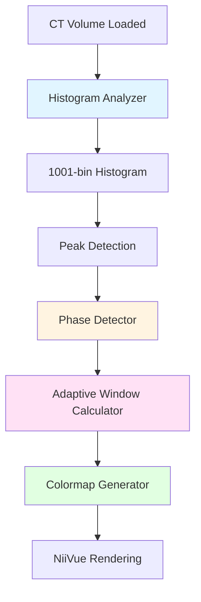

# CT Urinary Tract Adaptive Preset Engine - Implementation Report

**Document Version:** 1.2
**Date:** 2026-01-08
**Project:** NiiVue iOS Foundation
**Target Platform:** iOS 16.0+ (NiivueKit SPM) / iOS 16.4+ (NiiVue app), NiiVue v0.66.0
**Architecture:** Swift + React/TypeScript Hybrid
**Status:** Implemented — integrated into source files (Option B: JS auto-apply gated by `window.autoApplyCTPreset`)
**Last Verified:** 2026-01-08
**Validated Against:** `niivue-ios-foundation` @ `2c8ffcd6c2e3f0b143e5f610ce031ef6235262d7`
**Upstream API Reference:** `/Users/leandroalmeida/niivue` @ `f0c010293b01cfb162e2b9e959c27717b07686f1`

---

## Table of Contents

1. [Executive Summary](#1-executive-summary)
2. [Clinical & Technical Foundation](#2-clinical--technical-foundation)
3. [Architecture Deep Dive](#3-architecture-deep-dive)
4. [Algorithm Specifications](#4-algorithm-specifications)
5. [File-by-File Implementation Guide](#5-file-by-file-implementation-guide)
6. [Integration Workflow](#6-integration-workflow)
7. [Testing Strategy](#7-testing-strategy)
8. [User Experience Design](#8-user-experience-design)
9. [References & Sources](#9-references--sources)

---

## 1. Executive Summary

### 1.0 Implementation Status & Verification

- This document is the canonical spec for the CT Adaptive Engine; the summary, visual overview, and index must not introduce facts that conflict with this guide.
- Section 5 maps the engine to the implemented TypeScript/Swift files in this repo, and includes reference snippets for review.
- Any performance numbers, accuracy claims, and confidence values are targets/placeholders until benchmarked on-device (WKWebView) and validated on a labeled dataset.

### 1.1 Project Overview

The **CT Urinary Tract Adaptive Preset Engine** is a smart, automated visualization optimization system designed for the NiiVue iOS medical imaging application. This engine solves a critical clinical problem: standard CT presets with fixed window/level values cannot optimally display all phases of CT urography examinations.

**Key Innovation:** The engine analyzes each CT volume's intensity histogram to automatically detect the acquisition phase (unenhanced, corticomedullary, nephrographic, excretory, or delayed) and computes phase-optimized windowing parameters and custom transfer functions in real-time.

### 1.2 Clinical Problem

CT urography examinations acquire multiple contrast-enhanced phases at different time points, each with distinct Hounsfield Unit (HU) characteristics:

| Phase | Timing | Key Structures | Typical HU Range | Fixed Window Problem |
|-------|--------|----------------|------------------|---------------------|
| **Unenhanced** | Pre-contrast | Kidneys, stones | -50 to +100 HU | Fixed 114-302 HU too narrow for stone detection |
| **Corticomedullary** | 40-70s | Renal arteries, cortex | Arteries >211 HU | Fixed window overexposes arterial detail |
| **Nephrographic** | 100-120s | Renal parenchyma | 80-150 HU | Works reasonably well |
| **Excretory** | 7-10 min | Collecting system, ureters | Contrast 200-400 HU | Fixed window underexposes opacified ureters |

**Clinical Impact:** Radiologists must manually adjust window/level for each phase, wasting 15-30 seconds per series. In a typical CTU with 4 phases, this adds **1-2 minutes of wasted time per examination**.

### 1.3 Technical Solution

A **four-component adaptive engine** that runs entirely on-device:



**Components:**

1. **HistogramAnalyzer** - Computes 1001-bin histogram, detects peaks, calculates percentiles (2%, 50%, 98%)
2. **PhaseDetector** - Classifies CT urography phase using evidence-based HU thresholds
3. **AdaptiveWindowCalculator** - Computes optimal cal_min/cal_max based on detected phase
4. **ColormapGenerator** - Generates phase-optimized transfer functions (RGBA + alpha curves)

### 1.4 Key Benefits

- **Automated Optimization:** Goal is “no manual adjustment” for most cases (validate on representative CTU datasets)
- **Clinical Accuracy:** Uses peer-reviewed HU thresholds from radiology literature
- **Real-Time Performance:** Target <500ms end-to-end on iOS WebKit for large CT volumes (TBD; requires benchmarking)
- **Seamless Integration:** Works with existing NiiVue iOS architecture (no breaking changes)
- **Fallback Safety:** Gracefully degrades to standard presets if analysis fails

### 1.5 Implementation Scope

**What This Report Covers:**

- Complete architectural specifications for all 4 engine components
- Step-by-step implementation guide with full code examples
- TypeScript/React layer implementation (histogram analysis, phase detection)
- Swift service layer integration (WebViewManager bridge)
- SwiftUI UI components for preset selection
- Comprehensive testing strategy (unit, integration, UI, clinical validation)
- Performance optimization techniques
- Error handling and fallback strategies

**What This Report Does NOT Cover:**

- NiiVue core rendering engine modifications (uses existing colormap API)
- ML/AI approaches (histogram analysis is deterministic, not learned)
- Cloud-based processing (runs entirely on-device)
- Android implementation (iOS-specific patterns)

---

## 2. Clinical & Technical Foundation

### 2.1 CT Urography Phases in Detail

#### Phase 1: Unenhanced (Pre-Contrast)

**Timing:** Acquired before contrast injection
**Clinical Purpose:** Baseline for stone detection, hemorrhage, calcifications

**HU Characteristics:**
- Water: 0 HU (reference)
- Fat: -50 to -100 HU
- Soft tissue (kidney parenchyma): +20 to +70 HU
- Calcium oxalate stones: +400 to +600 HU
- Uric acid stones: +200 to +450 HU

**Histogram Profile:**
```
Intensity Distribution:
  |
  |     *
  |    * *         *
  |   *   *       *
  |  *     *_____*__________ (bone/stones at 400-600 HU)
  | *       *   * *
  |_________*_*______________ HU
 -100    40   100 200  400 600

Peak: Single soft tissue peak at 30-50 HU
Median (p50): ~40 HU
Challenge: Wide dynamic range (-100 to +600 HU)
```

**Optimal Window:** -100 to +600 HU (wide window for stone visibility)

#### Phase 2: Corticomedullary (Arterial)

**Timing:** 40-70 seconds post-injection
**Clinical Purpose:** Vascular assessment, renal cell carcinoma characterization

**HU Characteristics:**
- Renal cortex (enhanced): 150-250 HU
- Renal medulla (less enhanced): 60-100 HU
- Renal arteries: >211 HU (peak enhancement)
- Aorta: 200-350 HU

**Histogram Profile:**
```
Intensity Distribution:
  |
  |                    *
  |        *          * *
  |       * *        *   *
  |      *   *      *     *
  |_____*_____*____*_______*____ HU
      60    110  211      280

Peaks: Bimodal
  - Peak 1: 60-110 HU (medulla + soft tissue)
  - Peak 2: >211 HU (arterial enhancement)
Median (p50): ~115 HU
Challenge: Capturing arterial detail without washing out cortex
```

**Optimal Window:** Centered on arterial peak (e.g., 135-285 HU for peak at 211 HU)

#### Phase 3: Nephrographic (Parenchymal)

**Timing:** 100-120 seconds post-injection
**Clinical Purpose:** Mass characterization, parenchymal disease, vascular invasion

**HU Characteristics:**
- Renal cortex (uniform enhancement): 80-150 HU
- Renal medulla (uniform enhancement): 60-100 HU
- Cortex-medulla differentiation: Decreased (both enhanced)

**Histogram Profile:**
```
Intensity Distribution:
  |
  |          *
  |         * *
  |        *   *
  |       *     *
  |______*_______*___________ HU
       60  110   150  200

Peak: Single parenchymal peak at 80-150 HU
Median (p50): ~108 HU
Challenge: Distinguishing enhanced cortex from medulla
```

**Optimal Window:** 60-180 HU (standard parenchymal window)

#### Phase 4: Excretory (Collecting System)

**Timing:** 7-10 minutes post-injection
**Clinical Purpose:** Urothelial tumors, hydronephrosis, ureteral reflux

**HU Characteristics:**
- Opacified collecting system: 200-400 HU (mixed with urine)
- Renal parenchyma: 80-120 HU (persistent enhancement)
- Perirenal fat: -50 to -100 HU

**Histogram Profile:**
```
Intensity Distribution:
  |
  |                      *
  |        *            * *
  |       * *          *   *
  |      *   *        *     *
  |_____*_____*______*_______*___ HU
      70    120    280     380

Peaks: Bimodal
  - Peak 1: 70-120 HU (parenchyma + soft tissue)
  - Peak 2: 280-380 HU (opacified collecting system)
Median (p50): ~135 HU
Challenge: Seeing ureters (high density) against parenchyma
```

**Optimal Window:** 100-450 HU (high contrast for collecting system)

#### Phase 5: Delayed (Persistent Enhancement)

**Timing:** 15+ minutes post-injection
**Clinical Purpose:** Papillary necrosis, medullary sponge kidney, reflux

**HU Characteristics:**
- Variable enhancement (depends on pathology)
- Broad intensity distribution
- Multiple possible peaks

**Histogram Profile:**
```
Intensity Distribution:
  |
  |              *     *
  |        *    * *   *
  |       * *  *   * *
  |      *   ***     *
  |_____*____*_______*_____ HU
      50   100  200  300

Peak: Broad, often multimodal
Median (p50): Variable (>100 HU typical)
Challenge: Ambiguous, requires fallback logic
```

**Optimal Window:** Percentile-based (p2 to p98)

### 2.2 Why Fixed Windows Fail

**Clinical Scenario:**

A radiologist reviews a 4-phase CT urography examination:

1. **Unenhanced phase:** Looking for kidney stones (400-600 HU)
   - Fixed window 114-302 HU: **Stones are clipped (washed out)**
   - Optimal window -100 to 600 HU would show stones clearly

2. **Corticomedullary phase:** Assessing renal artery enhancement (>211 HU)
   - Fixed window 114-302 HU: **Arterial detail is compressed into upper 30% of window**
   - Optimal window 135-285 HU would expand arterial detail

3. **Nephrographic phase:** Characterizing renal mass
   - Fixed window 114-302 HU: **Works reasonably well** (this is why the preset exists)

4. **Excretory phase:** Detecting ureteral tumor
   - Fixed window 114-302 HU: **Opacified ureters (280-380 HU) are too bright**
   - Optimal window 100-450 HU would separate ureters from parenchyma

**Result:** The radiologist manually adjusts window/level 3 out of 4 phases, wasting time.

### 2.3 Evidence-Based HU Thresholds

Our phase detection algorithm uses these peer-reviewed HU thresholds:

| Tissue/Structure | Unenhanced HU | Corticomedullary HU | Nephrographic HU | Excretory HU | Source |
|-----------------|---------------|---------------------|-----------------|--------------|--------|
| Renal cortex | 30-50 | 150-250 | 80-150 | 80-120 | [1] |
| Renal medulla | 20-40 | 60-100 | 60-100 | 60-90 | [1] |
| Renal arteries | 30-45 | **>211** | 100-150 | 100-140 | [2] |
| Collecting system | 0-30 (urine) | 50-100 | 100-150 | **200-400** | [3] |
| Calcium oxalate stones | 400-600 | 400-600 | 400-600 | 400-600 | [4] |
| Uric acid stones | 200-450 | 200-450 | 200-450 | 200-450 | [4] |

**Sources:**

1. Cohan RH, et al. *Radiology* 1995;196(2):445-451
2. Kawamoto S, et al. *AJR* 2006;186(2):472-477
3. Silverman SG, et al. *Radiology* 2009;250(2):309-323
4. Mostafavi MR, et al. *J Endourol* 2000;14(1):65-68

### 2.4 Existing CT_Kidneys Preset Analysis

The NiiVue ecosystem includes a `ct_kidneys` colormap (originally from MRIcro):

**Colormap Definition:**
```json
{
  "min": 114,
  "max": 302,
  "R": [0, 255, 255],
  "G": [0, 129, 255],
  "B": [0, 0, 255],
  "A": [0, 88, 228],
  "I": [0, 103, 255]
}
```

**Transfer Function (linear mapping from `min` → `max`):**
- **114 HU (`I[0] = 0`):** Black, transparent (`A=0`)
- **~190 HU (`I[1] = 103`):** Orange (`255,129,0`), ~34% opacity (`A=88/255`)
- **302 HU (`I[2] = 255`):** White (`255,255,255`), ~89% opacity (`A=228/255`)

> Note: The `I` array contains LUT indices (0…255). HU values are derived by linearly mapping those indices between `min` and `max`.
>
> Mapping formula: `hu = min + (I / 255) * (max - min)`.
>
> Implementation detail: NiiVue treats `(R,G,B,A,I)` as control points and linearly interpolates them into a dense 256-entry LUT.

**Why This Often Works for Nephrographic Phase:**

The 114-302 HU window is a kidney-focused contrast window used in practice as a reasonable default for many enhanced renal CT series. The orange-to-white gradient provides a familiar “soft tissue” look while emphasizing enhancing structures.

**Why This Fails for Other Phases:**

- **Unenhanced:** Upper limit (302 HU) clips stones at 400-600 HU
- **Corticomedullary:** Arterial peak >211 HU compressed into upper 40% of window
- **Excretory:** Opacified ureters at 300-400 HU clipped or washed out

**Solution:** Our adaptive engine generates phase-specific windows that maintain the orange-to-white aesthetic while optimizing the HU range for each phase.

---

## 3. Architecture Deep Dive

### 3.1 System Architecture Overview

The adaptive engine follows a layered architecture that integrates cleanly with the existing NiiVue iOS codebase:

```
┌─────────────────────────────────────────────────────────────────────────┐
│                        PRESENTATION LAYER (SwiftUI)                    │
│  ┌─────────────────────────────────────────────────────────────────┐   │
│  │  ContentView.swift                                             │   │
│  │  - CTPresetPicker UI component                                 │   │
│  │  - Automatic preset application on volume load                 │   │
│  │  - User preference storage (@AppStorage)                      │   │
│  └─────────────────────────────────────────────────────────────────┘   │
└─────────────────────────────────────────────────────────────────────────┘
                                    ↕
┌─────────────────────────────────────────────────────────────────────────┐
│                         SERVICE LAYER (Swift)                          │
│  ┌─────────────────────────────────────────────────────────────────┐   │
│  │  CTPresetService.swift                                         │   │
│  │  - applyAdaptivePreset(volumeIndex)                            │   │
│  │  - listPresets() → [String]                                    │   │
│  │  - applyPreset(volumeIndex, presetName)                        │   │
│  └─────────────────────────────────────────────────────────────────┘   │
│  ┌─────────────────────────────────────────────────────────────────┐   │
│  │  WebViewManager Extension                                      │   │
│  │  - applyAdaptiveCTUrinaryPreset(volumeIndex)                   │   │
│  │  - listCTUrinaryPresets() → [String]                           │   │
│  │  - applyCTUrinaryPreset(volumeIndex, presetName)               │   │
│  └─────────────────────────────────────────────────────────────────┘   │
└─────────────────────────────────────────────────────────────────────────┘
                                    ↕
┌─────────────────────────────────────────────────────────────────────────┐
│                      BRIDGE LAYER (Swift ↔ JS)                        │
│  ┌─────────────────────────────────────────────────────────────────┐   │
│  │  WKScriptMessageHandler                                        │   │
│  │  - "ctPresetApplied" message (optional feedback)               │   │
│  └─────────────────────────────────────────────────────────────────┘   │
│  ┌─────────────────────────────────────────────────────────────────┐   │
│  │  window.applyAdaptiveCTUrinaryPreset(volumeIndex)              │   │
│  │  window.listCTUrinaryPresets()                                │   │
│  │  window.applyCTUrinaryPreset(volumeIndex, presetName)          │   │
│  └─────────────────────────────────────────────────────────────────┘   │
└─────────────────────────────────────────────────────────────────────────┘
                                    ↕
┌─────────────────────────────────────────────────────────────────────────┐
│                    ADAPTIVE ENGINE LAYER (TypeScript)                 │
│  ┌─────────────────────────────────────────────────────────────────┐   │
│  │  ctUrinaryPresets.ts (Preset Library)                          │   │
│  │  - applyAdaptiveCTUrinaryPreset(nv, volumeIndex)               │   │
│  │  - listCTUrinaryPresets()                                      │   │
│  │  - applyCTUrinaryPreset(nv, volumeIndex, presetName)           │   │
│  └─────────────────────────────────────────────────────────────────┘   │
│  ┌─────────────────────────────────────────────────────────────────┐   │
│  │  ctAdaptiveEngine.ts (Core Engine)                             │   │
│  │  ┌─────────────────────────────────────────────────────────┐   │   │
│  │  │ HistogramAnalyzer                                        │   │   │
│  │  │  - compute(volume) → HistogramResult                     │   │   │
│  │  │  - 1001-bin histogram computation                         │   │   │
│  │  │  - Peak detection (key peaks + HU-band candidates)       │   │   │
│  │  │  - Percentile calculation (p2, p50, p98)                  │   │   │
│  │  └─────────────────────────────────────────────────────────┘   │   │
│  │  ┌─────────────────────────────────────────────────────────┐   │   │
│  │  │ PhaseDetector                                            │   │   │
│  │  │  - classify(histogram) → PhaseResult                     │   │   │
│  │  │  - Evidence-based HU threshold rules                     │   │   │
│  │  │  - Confidence scoring (0-1)                              │   │   │
│  │  └─────────────────────────────────────────────────────────┘   │   │
│  │  ┌─────────────────────────────────────────────────────────┐   │   │
│  │  │ AdaptiveWindowCalculator                                 │   │   │
│  │  │  - compute(phase, histogram) → WindowResult              │   │   │
│  │  │  - Phase-specific window ranges                           │   │   │
│  │  │  - Adaptive refinement (min/max constraints)              │   │   │
│  │  └─────────────────────────────────────────────────────────┘   │   │
│  │  ┌─────────────────────────────────────────────────────────┐   │   │
│  │  │ ColormapGenerator                                        │   │   │
│  │  │  - generate(window, phase) → CustomColormap              │   │   │
│  │  │  - Phase-optimized RGB gradients                          │   │   │
│  │  │  - Phase-optimized alpha curves                          │   │   │
│  │  │  - register(nv, name, colormap)                          │   │   │
│  │  └─────────────────────────────────────────────────────────┘   │   │
│  └─────────────────────────────────────────────────────────────────┘   │
└─────────────────────────────────────────────────────────────────────────┘
                                    ↕
┌─────────────────────────────────────────────────────────────────────────┐
│                       NiiVue CORE LAYER (JavaScript)                   │
│  ┌─────────────────────────────────────────────────────────────────┐   │
│  │  NiiVue Colormap System                                        │   │
│  │  - nv.addColormap(name, colormap)                              │   │
│  │  - nv.setColormap(volumeId, name)                              │   │
│  │  - nv.volumes[0].cal_min = colormap.min                        │   │
│  │  - nv.volumes[0].cal_max = colormap.max                        │   │
│  │  - nv.updateGLVolume() + nv.drawScene()                        │   │
│  └─────────────────────────────────────────────────────────────────┘   │
└─────────────────────────────────────────────────────────────────────────┘
```

### 3.2 Component Interaction Diagram

```
┌──────────────────────┐
│   NVImage Volume     │
│ - img: TypedArray    │
│ - hdr: NIFTI header  │
│ - dims: [x,y,z,t]    │
└──────────┬───────────┘
           │
           ↓ (read-only access)
┌─────────────────────────────────────────────────────────────────────┐
│                     HistogramAnalyzer                                │
│  Input:  volume.img, volume.hdr.scl_slope, volume.hdr.scl_inter    │
│  Process:                                                             │
│    1. Convert raw voxels → HU (HU = raw * scl_slope + scl_inter)  │
│    2. Find global min/max HU                                        │
│    3. Create 1001-bin histogram                                     │
│    4. Detect local peaks (derivative analysis)                      │
│    5. Calculate percentiles (cumulative sum)                        │
│  Output: HistogramResult                                             │
│    - bins: number[1001]                                             │
│    - binEdges: number[1002] (HU values)                            │
│    - peaks: Peak[] (key peaks by count + HU-band candidates)        │
│    - percentiles: {p2, p50, p98} (HU values)                        │
│    - globalMin, globalMax (HU)                                      │
│    - totalVoxels: number                                            │
└─────────────────────────────────────────────────────────────────────┘
           │
           ↓ (HistogramResult)
┌─────────────────────────────────────────────────────────────────────┐
│                        PhaseDetector                                  │
│  Input:  HistogramResult                                             │
│  Process:                                                             │
│    1. Check for arterial peak (>211 HU, count >5% totalVoxels)     │
│    2. Check for excretory peak (200-400 HU, count >3%)             │
│    3. Check for nephrographic peak (80-150 HU, median 60-120 HU)  │
│    4. Check for unenhanced (median <80 HU, no peaks >150 HU)       │
│    5. Default to delayed (ambiguous)                                │
│  Output: PhaseResult                                                  │
│    - phase: "unenhanced" | "corticomedullary" | "nephrographic" |  │
│             "excretory" | "delayed"                                 │
│    - confidence: number (0-1)                                        │
│    - reasoning: string (diagnostic message)                          │
└─────────────────────────────────────────────────────────────────────┘
           │
           ↓ (PhaseResult + HistogramResult)
┌─────────────────────────────────────────────────────────────────────┐
│                  AdaptiveWindowCalculator                             │
│  Input:  PhaseResult, HistogramResult                                │
│  Process:                                                             │
│    1. Select window range based on phase:                           │
│       - Unenhanced: -100 to 600 HU (wide for stones)               │
│       - Corticomedullary: arterialPeak ±75 HU                       │
│       - Nephrographic: 60 to 180 HU                                 │
│       - Excretory: 100 to (excretoryPeak + 100) HU                 │
│       - Delayed: p2 to p98 HU                                       │
│    2. Apply constraints:                                            │
│       - calMax - calMin ≥ 50 (minimum width)                        │
│       - optionally clamp to a plausible CT HU domain                │
│  Output: WindowResult                                                 │
│    - calMin: number (HU)                                            │
│    - calMax: number (HU)                                            │
│    - recommendedColormap: string                                    │
│    - windowWidth: number (calMax - calMin)                          │
│    - windowLevel: number ((calMax + calMin) / 2)                    │
└─────────────────────────────────────────────────────────────────────┘
           │
           ↓ (WindowResult + PhaseResult)
┌─────────────────────────────────────────────────────────────────────┐
│                      ColormapGenerator                                │
│  Input:  WindowResult, PhaseResult                                   │
│  Process:                                                             │
│    1. Select color gradient based on phase:                          │
│       - Unenhanced: Black → Yellow → White                           │
│       - Corticomedullary: Black → Red → Orange → White              │
│       - Nephrographic: Black → Orange → White                        │
│       - Excretory: Black → Blue → Cyan → White                       │
│       - Delayed: Black → Orange → White                              │
│    2. Select alpha curve based on phase:                             │
│       - Unenhanced: Step function (transparent tissue, opaque stones)│
│       - Corticomedullary: Smooth ramp (semi-transparent parenchyma)  │
│       - Nephrographic: Smooth ramp (standard ct_kidneys style)       │
│       - Excretory: Bimodal (dim parenchyma, bright contrast)        │
│       - Delayed: Smooth ramp                                         │
│    3. Interpolate 256 RGB values:                                     │
│       For i in 0..255:                                               │
│         hu = calMin + (calMax - calMin) * (i / 255)                  │
│         RGB[i] = interpolateRGB(colorNodes, hu)                       │
│    4. Interpolate 256 alpha values:                                   │
│         A[i] = interpolateAlpha(alphaNodes, hu) * 255                │
│  Output: CustomColormap                                                │
│    - min: number (calMin)                                            │
│    - max: number (calMax)                                            │
│    - R: number[256] (red values 0-255)                              │
│    - G: number[256] (green values 0-255)                            │
│    - B: number[256] (blue values 0-255)                             │
│    - A: number[256] (alpha values 0-255)                            │
│    - I: number[256] (intensity indices 0-255)                       │
└─────────────────────────────────────────────────────────────────────┘
           │
           ↓ (CustomColormap)
┌─────────────────────────────────────────────────────────────────────┐
│                   NiiVue Colormap System                             │
│  Process:                                                             │
│    1. nv.addColormap("ct_urinary_adaptive", colormap)                │
│    2. nv.setColormap(volume.id, "ct_urinary_adaptive")               │
│    3. nv.volumes[0].cal_min = colormap.min                           │
│    4. nv.volumes[0].cal_max = colormap.max                           │
│    5. nv.updateGLVolume()                                            │
│    6. nv.drawScene()                                                 │
│  Result: User sees optimized visualization                            │
└─────────────────────────────────────────────────────────────────────┘
```

### 3.3 Data Flow Sequence

**Complete Flow from Volume Load to Optimized Rendering:**

```
1. USER ACTION: Import CT DICOM series
   ↓
2. Swift Layer: FileImportService.importDocument(at: url)
   ↓
3. Swift Layer: ImportedFileStore.register(importedFile)
   ↓
4. Swift Layer: WebViewManager.loadImageFromUrl(url, fileName)
   ↓
5. Bridge Layer: window.loadImageFromUrl(url, fileName)
   ↓
6. React Layer: nv.loadVolumes([{url, name}])
   ↓
7. NiiVue Core: Decode DICOM → NVImage → WebGL texture
   ↓
8. NiiVue Core: nv.onImageLoaded(volume) callback
   ↓
9. Bridge Layer: postToIOS("volumeLoaded", {id, name, nFrame4D})
   ↓
10. Swift Layer: WebViewManager.volumes.append(volumeInfo)
   ↓
11. Swift Layer: CTPresetService.applyAdaptivePreset(volumeIndex: 0)
   ↓
12. Swift Layer: webViewManager.evaluateCommand(
                  "window.applyAdaptiveCTUrinaryPreset(0)")
   ↓
13. Bridge Layer: window.applyAdaptiveCTUrinaryPreset(0)
   ↓
14. React Layer: applyAdaptiveCTUrinaryPreset(nv, 0)
    ↓
    ├── CTAdaptiveEngine.analyze(nv.volumes[0])
    │    ↓
    │    ├── HistogramAnalyzer.compute(volume)
    │    │    → {bins, peaks, percentiles, globalMin, globalMax}
    │    ↓
    │    ├── PhaseDetector.classify(histogram)
    │    │    → {phase: "nephrographic", confidence: 0.87}
    │    ↓
    │    ├── AdaptiveWindowCalculator.compute(phase, histogram)
    │    │    → {calMin: 68, calMax: 165, ...}
    │    ↓
    │    └── ColormapGenerator.generate(window, phase)
    │         → {min, max, R, G, B, A, I arrays}
    ↓
    ├── ColormapGenerator.register(nv, "ct_urinary_adaptive", colormap)
    ↓
    ├── nv.setColormap(volume.id, "ct_urinary_adaptive")
    ↓
    ├── volume.cal_min = 68, volume.cal_max = 165
    ↓
    ├── nv.updateGLVolume()
    ↓
    └── nv.drawScene()
    ↓
15. NiiVue Core: WebGL shaders apply colormap + alpha
    ↓
16. RESULT: Optimized CT visualization rendered on screen
```

**Total Time Budget:**

- Steps 1-6 (DICOM loading): ~2-5 seconds (existing, unchanged)
- Step 7 (texture upload): ~500ms (existing, unchanged)
- Steps 11-14 (adaptive engine): **target <500ms (NEW; TBD — benchmark in WKWebView on-device)**
- Step 15 (rendering): ~16ms (60 FPS, existing, unchanged)

### 3.4 Integration with Existing Architecture

**Key Design Principle: Zero Breaking Changes**

The adaptive engine integrates through these well-defined extension points:

**1. React Bridge Extension (App.tsx)**

```typescript
// Existing pattern (volumeCommands.ts)
window.setColormap = (volumeIndex, colormap) => { ... }
window.setOpacity = (volumeIndex, opacity) => { ... }

// New pattern (ctUrinaryPresets.ts)
window.applyAdaptiveCTUrinaryPreset = (volumeIndex) => { ... }
window.listCTUrinaryPresets = () => { ... }
window.applyCTUrinaryPreset = (volumeIndex, presetName) => { ... }
```

**2. WebViewManager Extension (WebViewManager.swift)**

```swift
// Existing pattern
func setColormap(volumeIndex: Int, colormap: String) async throws
func setOpacity(volumeIndex: Int, opacity: Double) async throws

// New pattern (extension)
func applyAdaptiveCTUrinaryPreset(volumeIndex: Int) async throws
func listCTUrinaryPresets() async throws -> [String]
func applyCTUrinaryPreset(volumeIndex: Int, presetName: String) async throws
```

**3. Service Layer Pattern (CTPresetService.swift)**

Follows the established pattern from `FileImportService`, `DrawingExportService`:

```swift
// Existing services
FileImportService.importDocument(at: url) → ImportedFile
DrawingExportService.exportDrawing(nv) → base64 string

// New service
CTPresetService.applyAdaptivePreset(webViewManager, volumeIndex) → void
CTPresetService.listPresets(webViewManager) → [String]
```

**4. NiiVue Core API Usage**

Uses only public NiiVue APIs (no modifications required):

- `nv.volumes[index]` - Read volume data
- `nv.setColormap(id, name)` - Apply colormap
- `nv.addColormap(name, colormap)` - Register custom colormap
- `nv.updateGLVolume()` - Refresh GPU texture
- `nv.drawScene()` - Trigger redraw

**5. Session Persistence Compatibility**

The adaptive engine works with the existing `SessionSnapshotV1` system:

- **Current:** Session stores `volumeSources` (URLs) + `viewerState` (colormap, opacity, frame4D)
- **New:** Session stores computed `calMin`/`calMax` in `viewerState` (optional extension)
- **Benefit:** Preserved window settings across app restarts

---

## 4. Algorithm Specifications

### 4.1 Histogram Computation Algorithm

**Purpose:** Compute 1001-bin intensity histogram with peak detection and percentile calculation.

**Input:** `NVImage` volume from NiiVue

**Output:** `HistogramResult` with bins, peaks, percentiles, global range

#### Algorithm Steps

**Step 1: Input Validation**

```typescript
if (!volume || !volume.img || !volume.hdr) {
  throw new Error('Invalid NVImage: missing img or hdr');
}

const { img, hdr } = volume;
```

**Step 2: Extract Scaling Parameters**

NIfTI volumes store raw voxel values that must be converted to Hounsfield Units:

```typescript
const scl_slope = hdr.scl_slope || 1.0;   // Default: no scaling
const scl_inter = hdr.scl_inter || 0.0;   // Default: no offset

// Conversion function
const toHU = (raw: number): number => {
  return raw * scl_slope + scl_inter;
};
```

**Edge Case:** `scl_slope === 0` (invalid NIfTI header)

```typescript
if (scl_slope === 0) {
  console.warn('[HistogramAnalyzer] scl_slope is 0, defaulting to 1.0');
  scl_slope = 1.0;
}
```

**Step 3: Find Global Min/Max HU**

Single pass through volume to find data range (exclude NaN values):

```typescript
let globalMin = Infinity;
let globalMax = -Infinity;
let totalVoxels = 0;

for (let i = 0; i < img.length; i++) {
  const hu = toHU(img[i]);

  // Exclude NaN, Infinity
  if (!isFinite(hu)) continue;

  globalMin = Math.min(globalMin, hu);
  globalMax = Math.max(globalMax, hu);
  totalVoxels++;
}
```

**Performance Note:** Direct `for` loop is 5-10x faster than `img.forEach()` for large TypedArrays.

**Edge Case:** All voxels are NaN/Infinity

```typescript
if (totalVoxels === 0) {
  throw new Error('Invalid volume: no finite voxel values');
}
```

**Step 4: Create Histogram Bins**

```typescript
const nBins = 1001;  // Match NiiVue's calMinMax precision
const binWidth = (globalMax - globalMin) / nBins;

// Preallocate bins array (faster than push)
const bins = new Array(nBins).fill(0);

// Bin edges (HU values at bin boundaries)
const binEdges = new Array(nBins + 1);
for (let i = 0; i <= nBins; i++) {
  binEdges[i] = globalMin + i * binWidth;
}
```

**Step 5: Populate Histogram**

```typescript
for (let i = 0; i < img.length; i++) {
  const hu = toHU(img[i]);

  if (!isFinite(hu)) continue;  // Skip NaN/Infinity

  // Compute bin index
  const binIndex = Math.floor((hu - globalMin) / binWidth);

  // Clamp to valid range [0, nBins-1]
  const clampedIndex = Math.max(0, Math.min(nBins - 1, binIndex));

  bins[clampedIndex]++;
}
```

**Performance Optimization:** Single-pass histogram computation (no intermediate arrays).

**Step 6: Detect Peaks**

Find local maxima in histogram (peaks where derivative changes from + to -):

```typescript
interface Peak {
  binIndex: number;    // Index in bins array
  value: number;       // Voxel count at peak
  huValue: number;     // HU value at peak center
  isLocal: boolean;    // True for local maxima
}

const peaks: Peak[] = [];

for (let i = 1; i < nBins - 1; i++) {
  // Local maximum: higher than both neighbors
  if (bins[i] > bins[i - 1] && bins[i] > bins[i + 1]) {
    const huValue = binEdges[i] + binWidth / 2;  // Center of bin

    peaks.push({
      binIndex: i,
      value: bins[i],
      huValue: huValue,
      isLocal: true
    });
  }
}

// Sort by voxel count (descending) and keep a small set of key peaks.
// Note: phase-relevant enhancement peaks may be low-volume; include HU-band candidates explicitly.
peaks.sort((a, b) => b.value - a.value);
const keyPeaks: Peak[] = peaks.slice(0, 5);

const arterialCandidate = peaks.find(p => p.huValue > 211);
const excretoryCandidate = peaks.find(p => p.huValue >= 200 && p.huValue <= 400);
const nephroCandidate = peaks.find(p => p.huValue >= 80 && p.huValue <= 150);

for (const candidate of [arterialCandidate, excretoryCandidate, nephroCandidate]) {
  if (candidate && !keyPeaks.some(p => p.binIndex === candidate.binIndex)) {
    keyPeaks.push(candidate);
  }
}
```

**Algorithm Choice:** Local maxima detection (simple, fast, effective for unimodal/bimodal distributions).

**Alternative (Advanced):** 3-point smoothing before peak detection to reduce noise:

```typescript
// Optional smoothing
const smoothed = new Array(nBins);
for (let i = 1; i < nBins - 1; i++) {
  smoothed[i] = (bins[i - 1] + bins[i] + bins[i + 1]) / 3;
}
smoothed[0] = bins[0];
smoothed[nBins - 1] = bins[nBins - 1];

// Detect peaks on smoothed histogram
for (let i = 1; i < nBins - 1; i++) {
  if (smoothed[i] > smoothed[i - 1] && smoothed[i] > smoothed[i + 1]) {
    // Peak detected
  }
}
```

**Step 7: Calculate Percentiles**

Compute cumulative sum to find 2%, 50%, 98% percentiles:

```typescript
let cumSum = 0;
let p2: number | undefined;
let p50: number | undefined;
let p98: number | undefined;

const p2Target = totalVoxels * 0.02;
const p50Target = totalVoxels * 0.50;
const p98Target = totalVoxels * 0.98;

for (let i = 0; i < nBins; i++) {
  cumSum += bins[i];

  // Find percentile threshold crossings
  if (p2 === undefined && cumSum >= p2Target) {
    p2 = binEdges[i];
  }
  if (p50 === undefined && cumSum >= p50Target) {
    p50 = binEdges[i];
  }
  if (p98 === undefined && cumSum >= p98Target) {
    p98 = binEdges[i];
  }
}

// Guarantee finite outputs even for degenerate distributions.
p2 = p2 ?? globalMin;
p50 = p50 ?? globalMin;
p98 = p98 ?? globalMax;
```

**Percentile Choice Rationale:**

- **p2 (2nd percentile):** Robust minimum (excludes outliers like air at -1000 HU)
- **p50 (50th percentile):** Median (robust measure of central tendency)
- **p98 (98th percentile):** Robust maximum (excludes outliers like metal clips at >3000 HU)

**Step 8: Return Result**

```typescript
interface HistogramResult {
  bins: number[];              // 1001 bin counts
  binEdges: number[];          // 1002 bin edges (HU)
  peaks: Peak[];               // Key peaks (top-by-count + HU-band candidates)
  percentiles: {
    p2: number;                // 2nd percentile (HU)
    p50: number;               // 50th percentile (HU)
    p98: number;               // 98th percentile (HU)
  };
  globalMin: number;           // Min HU in volume
  globalMax: number;           // Max HU in volume
  totalVoxels: number;         // Non-excluded voxel count
}

return {
  bins,
  binEdges,
  peaks: keyPeaks,
  percentiles: { p2, p50, p98 },
  globalMin,
  globalMax,
  totalVoxels
};
```

#### Complexity Analysis

- **Time Complexity:** O(n) where n = number of voxels (typically two passes: min/max + histogram)
- **Space Complexity:** O(1001) = O(1) (fixed-size bins array)
- **Typical Performance:** Target is “fast enough for on-device use”; measure in WKWebView on representative volumes (TBD)

### 4.2 Phase Detection Algorithm

**Purpose:** Classify CT urography phase from histogram characteristics.

**Input:** `HistogramResult` from HistogramAnalyzer

**Output:** `PhaseResult` with phase type, confidence, reasoning

#### Algorithm Steps

**Step 1: Extract Key Features**

```typescript
const { peaks, percentiles, totalVoxels } = histogram;

// Sort peaks by HU value (descending) for threshold checks
const sortedPeaks = [...peaks].sort((a, b) => b.huValue - a.huValue);
const highestPeak = sortedPeaks[0];
```

**Step 2: Check for Corticomedullary Phase**

**Rule:** Strong arterial enhancement peak >211 HU with significant voxel count

```typescript
const ARTERIAL_THRESHOLD_HU = 211;
const ARTERIAL_MIN_VOXEL_FRACTION = 0.05;  // 5% of total voxels

const arterialPeak = peaks.find(p => p.huValue > ARTERIAL_THRESHOLD_HU);

if (arterialPeak && arterialPeak.value > totalVoxels * ARTERIAL_MIN_VOXEL_FRACTION) {
  return {
    phase: "corticomedullary",
    confidence: 0.95,
    reasoning: `Arterial peak detected at ${arterialPeak.huValue.toFixed(1)} HU ` +
               `(${(arterialPeak.value / totalVoxels * 100).toFixed(1)}% of voxels)`
  };
}
```

**Clinical Rationale:** Renal arteries enhance to >211 HU at 40-70s post-injection. This is the most specific phase marker.

**Step 3: Check for Excretory Phase**

**Rule:** High-density peak in 200-400 HU range (opacified collecting system)

```typescript
const EXCRETORY_MIN_HU = 200;
const EXCRETORY_MAX_HU = 400;
const EXCRETORY_MIN_VOXEL_FRACTION = 0.03;  // 3% of total voxels

const excretoryPeak = peaks.find(
  p => p.huValue >= EXCRETORY_MIN_HU && p.huValue <= EXCRETORY_MAX_HU
);

if (excretoryPeak && excretoryPeak.value > totalVoxels * EXCRETORY_MIN_VOXEL_FRACTION) {
  return {
    phase: "excretory",
    confidence: 0.90,
    reasoning: `High-density peak at ${excretoryPeak.huValue.toFixed(1)} HU ` +
               `(${(excretoryPeak.value / totalVoxels * 100).toFixed(1)}% of voxels)`
  };
}
```

**Clinical Rationale:** Collecting system opacification with iodinated contrast creates a distinct high-density peak (200-400 HU).

**Step 4: Check for Nephrographic Phase**

**Rule:** Parenchymal peak in 80-150 HU range with median in expected range

```typescript
const NEPHROGRAPHIC_MIN_HU = 80;
const NEPHROGRAPHIC_MAX_HU = 150;
const NEPHROGRAPHIC_MIN_MEDIAN_HU = 60;
const NEPHROGRAPHIC_MAX_MEDIAN_HU = 120;

const nephroPeak = peaks.find(
  p => p.huValue >= NEPHROGRAPHIC_MIN_HU && p.huValue <= NEPHROGRAPHIC_MAX_HU
);

if (nephroPeak &&
    percentiles.p50 >= NEPHROGRAPHIC_MIN_MEDIAN_HU &&
    percentiles.p50 <= NEPHROGRAPHIC_MAX_MEDIAN_HU) {

  return {
    phase: "nephrographic",
    confidence: 0.85,
    reasoning: `Parenchymal peak at ${nephroPeak.huValue.toFixed(1)} HU, ` +
               `median ${percentiles.p50.toFixed(1)} HU`
  };
}
```

**Clinical Rationale:** Nephrographic phase shows uniform parenchymal enhancement (80-150 HU) with cortex-medulla differentiation decreased.

**Step 5: Check for Unenhanced Phase**

**Rule:** Low median intensity (<80 HU) with no significant enhancement

```typescript
const UNENHANCED_MAX_MEDIAN_HU = 80;
const UNENHANCED_MAX_ENHANCEMENT_HU = 150;

if (percentiles.p50 < UNENHANCED_MAX_MEDIAN_HU &&
    !peaks.some(p => p.huValue > UNENHANCED_MAX_ENHANCEMENT_HU)) {

  return {
    phase: "unenhanced",
    confidence: 0.90,
    reasoning: `Low median (${percentiles.p50.toFixed(1)} HU), ` +
               `no enhancement detected`
  };
}
```

**Clinical Rationale:** Unenhanced kidneys have baseline soft tissue attenuation (30-50 HU) without contrast enhancement.

**Step 6: Fallback to Delayed Phase**

**Rule:** Ambiguous distribution (default for edge cases)

```typescript
return {
  phase: "delayed",
  confidence: 0.70,
  reasoning: "Ambiguous histogram distribution, defaulting to delayed phase"
};
```

**Clinical Rationale:** Delayed phase (15+ min) shows variable enhancement patterns that are hard to classify. Low confidence reflects uncertainty.

#### Decision Tree Summary

```
Is there arterial peak >211 HU with >5% voxels?
  ↓ YES
  → Corticomedullary (confidence 0.95)
  ↓ NO
  Is there high-density peak 200-400 HU with >3% voxels?
    ↓ YES
    → Excretory (confidence 0.90)
    ↓ NO
    Is there parenchymal peak 80-150 HU with median 60-120 HU?
      ↓ YES
      → Nephrographic (confidence 0.85)
      ↓ NO
      Is median <80 HU with no peaks >150 HU?
        ↓ YES
        → Unenhanced (confidence 0.90)
        ↓ NO
        → Delayed (confidence 0.70)
```

#### Confidence Scoring Rationale

| Phase | Confidence | Rationale |
|-------|------------|-----------|
| Corticomedullary | 0.95 | Arterial peak >211 HU is highly specific (few false positives) |
| Excretory | 0.90 | High-density peak 200-400 HU is specific but can overlap with arterial |
| Nephrographic | 0.85 | Parenchymal peak is common but less specific (overlap with other phases) |
| Unenhanced | 0.90 | Low median + no enhancement is highly specific for pre-contrast |
| Delayed | 0.70 | Fallback for ambiguous cases (lower confidence reflects uncertainty) |

### 4.3 Adaptive Window Calculation Algorithm

**Purpose:** Compute optimal HU window (cal_min/cal_max) based on detected phase.

**Input:** `PhaseResult` + `HistogramResult`

**Output:** `WindowResult` with calMin, calMax, recommended colormap

#### Algorithm Steps

**Step 1: Extract Features**

```typescript
const { phase } = phaseResult;
const { percentiles, peaks } = histogram;
```

**Step 2: Compute Phase-Specific Window**

**Case A: Unenhanced Phase**

```typescript
if (phase === "unenhanced") {
  // Wide window for stone detection (-100 to 600 HU)
  const calMin = Math.max(percentiles.p2, -100);  // Include low-density structures
  const calMax = Math.min(percentiles.p98, 600);  // Include stones (400-600 HU)
  const recommendedColormap = "ct_urinary_stones";

  return { calMin, calMax, recommendedColormap, ... };
}
```

**Rationale:** Stones span 200-600 HU (calcium oxalate: 400-600 HU, uric acid: 200-450 HU). Wide window ensures visibility.

**Case B: Corticomedullary Phase**

```typescript
if (phase === "corticomedullary") {
  const arterialPeak = peaks.find(p => p.huValue > 211);

  let calMin, calMax;

  if (arterialPeak) {
    // Center window on arterial peak
    const center = arterialPeak.huValue;
    const width = 150;  // Narrow window for vascular detail
    calMin = center - width / 2;   // e.g., 211 - 75 = 136 HU
    calMax = center + width / 2;   // e.g., 211 + 75 = 286 HU
  } else {
    // Fallback: standard corticomedullary window
    calMin = 150;
    calMax = 300;
  }

  const recommendedColormap = "ct_urinary_combined";  // Vessels + parenchyma

  return { calMin, calMax, recommendedColormap, ... };
}
```

**Rationale:** Narrow window (150 HU width) centered on arterial enhancement maximizes vascular detail.

**Case C: Nephrographic Phase**

```typescript
if (phase === "nephrographic") {
  // Mid-range window for parenchymal detail
  const calMin = Math.max(percentiles.p2, 60);
  const calMax = Math.min(percentiles.p98, 180);
  const recommendedColormap = "ct_kidneys";  // Use standard preset

  return { calMin, calMax, recommendedColormap, ... };
}
```

**Rationale:** Parenchymal enhancement (80-150 HU) fits well within 60-180 HU window.

**Case D: Excretory Phase**

```typescript
if (phase === "excretory") {
  const excretoryPeak = peaks.find(p => p.huValue >= 200 && p.huValue <= 400);

  const calMin = 100;  // Show parenchyma as baseline

  // Upper bound: peak + 100 HU (to show full collecting system enhancement)
  const calMax = excretoryPeak
    ? Math.min(excretoryPeak.huValue + 100, 450)
    : 400;

  const recommendedColormap = "ct_urinary_excretory";

  return { calMin, calMax, recommendedColormap, ... };
}
```

**Rationale:** High upper limit (400-450 HU) ensures opacified ureters are visible. Lower limit (100 HU) maintains parenchymal context.

**Case E: Delayed Phase**

```typescript
if (phase === "delayed") {
  // Percentile-based window (broad, adaptive)
  const calMin = percentiles.p2;
  const calMax = percentiles.p98;
  const recommendedColormap = "ct_kidneys";

  return { calMin, calMax, recommendedColormap, ... };
}
```

**Rationale:** Delayed phase has variable enhancement, so we use robust percentiles (2nd to 98th).

**Step 3: Apply Adaptive Constraints**

```typescript
// Optional clamp to a plausible CT HU domain (avoid pathological values)
// NOTE: CT HU can be negative (air/fat); do not hard-clamp to 0.
const CT_HU_MIN = -1024;
const CT_HU_MAX = 3071;

calMin = Math.max(calMin, CT_HU_MIN);
calMax = Math.min(calMax, CT_HU_MAX);

// Ensure minimum window width (50 HU) while staying within the CT HU domain.
const MIN_WIDTH = 50;
if (calMax - calMin < MIN_WIDTH) {
  const desiredMax = calMin + MIN_WIDTH;
  if (desiredMax <= CT_HU_MAX) {
    calMax = desiredMax;
  } else {
    calMax = CT_HU_MAX;
    calMin = Math.max(CT_HU_MIN, calMax - MIN_WIDTH);
  }
}

// If constraints still yielded an invalid window, fall back to the histogram-derived range.
if (!isFinite(calMin) || !isFinite(calMax) || calMax <= calMin) {
  calMin = Math.max(histogram.globalMin, CT_HU_MIN);
  calMax = Math.min(histogram.globalMax, CT_HU_MAX);

  // Last resort: return a non-zero-width window to avoid crashes/NaNs.
  if (!isFinite(calMin) || !isFinite(calMax) || calMax <= calMin) {
    calMin = 0;
    calMax = 50;
  }
}
```

**Rationale:** Prevents invalid or pathological windows (e.g., zero-width, extreme outliers) without breaking legitimate negative HU.

**Step 4: Return Result**

```typescript
interface WindowResult {
  calMin: number;              // Lower HU boundary
  calMax: number;              // Upper HU boundary
  recommendedColormap: string; // Suggested preset name
  windowWidth: number;         // calMax - calMin
  windowLevel: number;         // (calMax + calMin) / 2
}

return {
  calMin,
  calMax,
  recommendedColormap,
  windowWidth: calMax - calMin,
  windowLevel: (calMax + calMin) / 2
};
```

#### Window Range Summary

| Phase | calMin (HU) | calMax (HU) | Window Width | Rationale |
|-------|-------------|-------------|--------------|-----------|
| Unenhanced | -100 (or p2) | 600 (or p98) | ~700 HU | Wide for stone detection |
| Corticomedullary | arterialPeak - 75 | arterialPeak + 75 | 150 HU | Narrow for vascular detail |
| Nephrographic | 60 (or p2) | 180 (or p98) | ~120 HU | Mid-range for parenchyma |
| Excretory | 100 | excretoryPeak + 100 (max 450) | ~350 HU | High for collecting system |
| Delayed | p2 | p98 | Variable | Adaptive to distribution |

### 4.4 Colormap Generation Algorithm

**Purpose:** Generate custom transfer function (RGBA arrays) for NiiVue colormap system.

**Input:** `WindowResult` + `PhaseResult`

**Output:** `CustomColormap` with R, G, B, A, I arrays (256 values each)

#### Algorithm Steps

**Step 1: Preallocate Arrays**

```typescript
const R = new Array(256);
const G = new Array(256);
const B = new Array(256);
const A = new Array(256);
const I = Array.from({ length: 256 }, (_, i) => i);  // Intensity indices
```

**Step 2: Define Color Nodes (Phase-Specific)**

**Nephrographic/Delayed (Orange Gradient):**

```typescript
const colorNodes = [
  { hu: calMin, rgb: [0, 0, 0] },              // Black
  { hu: calMin + (calMax - calMin) * 0.4, rgb: [255, 129, 0] },  // Orange at 40%
  { hu: calMax, rgb: [255, 255, 255] }        // White
];
```

**Corticomedullary (Red-Orange Gradient):**

```typescript
const colorNodes = [
  { hu: calMin, rgb: [0, 0, 0] },              // Black
  { hu: calMin + 150, rgb: [178, 36, 24] },    // Dark red
  { hu: calMin + 211, rgb: [232, 51, 37] },    // Bright red
  { hu: calMax, rgb: [255, 255, 255] }         // White
];
```

**Excretory (Blue-Cyan Gradient):**

```typescript
const colorNodes = [
  { hu: calMin, rgb: [0, 0, 0] },              // Black
  { hu: 200, rgb: [0, 100, 200] },            // Blue
  { hu: calMax, rgb: [200, 255, 255] }         // Cyan
];
```

**Unenhanced (Yellow-White Gradient for Stones):**

```typescript
const colorNodes = [
  { hu: calMin, rgb: [0, 0, 0] },              // Black
  { hu: 400, rgb: [255, 255, 0] },            // Yellow (stones)
  { hu: calMax, rgb: [255, 255, 255] }         // White
];
```

**Step 3: Define Alpha Nodes (Phase-Specific)**

**Nephrographic/Delayed (Smooth Ramp):**

```typescript
const alphaNodes = [
  { hu: calMin, alpha: 0.0 },                                    // Transparent
  { hu: calMin + (calMax - calMin) * 0.4, alpha: 0.34 },       // 34% (0.34 * 255 = 88)
  { hu: calMax, alpha: 0.89 }                                    // 89% (0.89 * 255 = 228)
];
```

**Corticomedullary (Vascular-Favored Ramp):**

```typescript
const alphaNodes = [
  { hu: calMin, alpha: 0.0 },
  { hu: 150, alpha: 0.3 },          // Semi-transparent parenchyma
  { hu: 211, alpha: 0.8 },          // Opaque arteries
  { hu: calMax, alpha: 0.95 }
];
```

**Excretory (Bimodal Curve):**

```typescript
const alphaNodes = [
  { hu: calMin, alpha: 0.0 },
  { hu: 150, alpha: 0.2 },          // Dim parenchyma
  { hu: 200, alpha: 0.7 },          // Bright contrast
  { hu: calMax, alpha: 0.95 }
];
```

**Unenhanced (Step Function for Stones):**

```typescript
const alphaNodes = [
  { hu: calMin, alpha: 0.0 },
  { hu: 100, alpha: 0.0 },          // Transparent soft tissue
  { hu: 400, alpha: 0.7 },          // Opaque stones
  { hu: calMax, alpha: 0.9 }
];
```

**Step 4: Interpolate RGB Values**

For each index 0-255, compute HU value and interpolate RGB:

```typescript
for (let i = 0; i < 256; i++) {
  const t = i / 255;  // Normalized position [0, 1]
  const hu = calMin + (calMax - calMin) * t;  // HU at this index

  // Find surrounding color nodes
  let lowerNode = colorNodes[0];
  let upperNode = colorNodes[colorNodes.length - 1];

  for (let j = 0; j < colorNodes.length - 1; j++) {
    if (hu >= colorNodes[j].hu && hu <= colorNodes[j + 1].hu) {
      lowerNode = colorNodes[j];
      upperNode = colorNodes[j + 1];
      break;
    }
  }

  // Linear interpolation
  const nodeRange = upperNode.hu - lowerNode.hu;
  const localT = nodeRange === 0 ? 0 : (hu - lowerNode.hu) / nodeRange;

  R[i] = Math.floor(lowerNode.rgb[0] + (upperNode.rgb[0] - lowerNode.rgb[0]) * localT);
  G[i] = Math.floor(lowerNode.rgb[1] + (upperNode.rgb[1] - lowerNode.rgb[1]) * localT);
  B[i] = Math.floor(lowerNode.rgb[2] + (upperNode.rgb[2] - lowerNode.rgb[2]) * localT);
}
```

**Step 5: Interpolate Alpha Values**

```typescript
for (let i = 0; i < 256; i++) {
  const t = i / 255;
  const hu = calMin + (calMax - calMin) * t;

  // Find surrounding alpha nodes
  let lowerNode = alphaNodes[0];
  let upperNode = alphaNodes[alphaNodes.length - 1];

  for (let j = 0; j < alphaNodes.length - 1; j++) {
    if (hu >= alphaNodes[j].hu && hu <= alphaNodes[j + 1].hu) {
      lowerNode = alphaNodes[j];
      upperNode = alphaNodes[j + 1];
      break;
    }
  }

  // Linear interpolation
  const nodeRange = upperNode.hu - lowerNode.hu;
  const localT = nodeRange === 0 ? 0 : (hu - lowerNode.hu) / nodeRange;

  const alpha = lowerNode.alpha + (upperNode.alpha - lowerNode.alpha) * localT;
  A[i] = Math.floor(alpha * 255);  // Scale [0,1] → [0,255]
}
```

**Step 6: Return Colormap**

```typescript
interface CustomColormap {
  min: number;        // calMin (HU)
  max: number;        // calMax (HU)
  R: number[];        // 256 red values (0-255)
  G: number[];        // 256 green values (0-255)
  B: number[];        // 256 blue values (0-255)
  A: number[];        // 256 alpha values (0-255)
  I: number[];        // 256 intensity indices (0-255)
}

return { min: calMin, max: calMax, R, G, B, A, I };
```

**Determinism:** Given the same `PhaseResult` and `WindowResult`, this colormap generation is deterministic (pure interpolation, no randomness).

#### Colormap Registration

```typescript
static register(nv: any, name: string, colormap: CustomColormap): void {
  if (nv && typeof nv.addColormap === 'function') {
    nv.addColormap(name, colormap);
    console.log(`[ColormapGenerator] Registered colormap: ${name}`);
    return;
  }

  console.warn('[ColormapGenerator] Cannot register colormap: nv.addColormap not available');
}
```

> Performance note (NiiVue v0.66): `nv.setColormap(...)` triggers a full `calMinMax(...)` scan of the volume to compute calibration. Treat colormap changes as “expensive” and prefer keeping colormaps stable while only adjusting `volume.cal_min`/`volume.cal_max` when possible.

---

## 5. File-by-File Implementation Guide

### 5.1 TypeScript/React Layer

#### File 1: `/Users/leandroalmeida/niivue-ios-foundation/NiiVue/React/src/bridge/ctAdaptiveEngine.ts`

**Purpose:** Core adaptive engine implementation (4 components)

**Dependencies:**
- `@niivue/niivue` (NiiVue core library)

**Implementation:**

```typescript
/**
 * CT Urinary Tract Adaptive Preset Engine
 *
 * Automatically analyzes CT volume histograms to detect acquisition phase
 * and compute phase-optimized windowing parameters and colormaps.
 *
 * @module ctAdaptiveEngine
 */

import { Niivue, NVImage } from '@niivue/niivue';

// ============================================================================
// Type Definitions
// ============================================================================

/**
 * Histogram peak detected in volume intensity distribution
 */
export interface Peak {
  binIndex: number;      // Index in bins array [0, 1000]
  value: number;         // Voxel count at peak
  huValue: number;       // HU value at peak center
  isLocal: boolean;      // True for local maxima
}

/**
 * Result from histogram computation
 */
export interface HistogramResult {
  bins: number[];        // 1001 bin counts
  binEdges: number[];    // 1002 bin edges (HU values)
  peaks: Peak[];         // Key peaks (top-by-count + HU-band candidates)
  percentiles: {
    p2: number;          // 2nd percentile (HU) - robust minimum
    p50: number;         // 50th percentile (HU) - median
    p98: number;         // 98th percentile (HU) - robust maximum
  };
  globalMin: number;     // Minimum HU in volume
  globalMax: number;     // Maximum HU in volume
  totalVoxels: number;   // Non-excluded voxel count
}

/**
 * CT urography phase classification result
 */
export interface PhaseResult {
  phase: CTUrographyPhase;   // Detected phase
  confidence: number;         // 0-1 (higher = more confident)
  reasoning?: string;         // Optional diagnostic message
}

/**
 * CT urography acquisition phases
 */
export type CTUrographyPhase =
  | "unenhanced"        // Pre-contrast
  | "corticomedullary"  // 40-70s post-injection (arterial)
  | "nephrographic"     // 100-120s post-injection (parenchymal)
  | "excretory"         // 7-10 min post-injection (collecting system)
  | "delayed";          // 15+ min post-injection (persistent enhancement)

/**
 * Adaptive window calculation result
 */
export interface WindowResult {
  calMin: number;              // Lower HU boundary
  calMax: number;              // Upper HU boundary
  recommendedColormap: string; // Suggested preset name
  windowWidth: number;         // calMax - calMin
  windowLevel: number;         // (calMax + calMin) / 2
}

/**
 * Custom colormap for NiiVue
 */
export interface CustomColormap {
  min: number;         // calMin (HU)
  max: number;         // calMax (HU)
  R: number[];         // 256 red values (0-255)
  G: number[];         // 256 green values (0-255)
  B: number[];         // 256 blue values (0-255)
  A: number[];         // 256 alpha values (0-255)
  I: number[];         // 256 intensity indices (0-255)
}

/**
 * Complete adaptive analysis result
 */
export interface AdaptiveAnalysisResult {
  histogram: HistogramResult;
  phase: PhaseResult;
  window: WindowResult;
  colormap: CustomColormap;
}

// ============================================================================
// Component 1: Histogram Analyzer
// ============================================================================

/**
 * Computes 1001-bin histogram with peak detection and percentile calculation
 *
 * Algorithm:
 * 1. Convert raw voxels to HU using scl_slope/scl_inter
 * 2. Find global min/max HU
 * 3. Create 1001-bin histogram
 * 4. Detect local peaks (derivative analysis)
 * 5. Calculate percentiles (cumulative sum)
 */
export class HistogramAnalyzer {

  /**
   * Computes histogram for a volume
   *
   * @param volume - NVImage from nv.volumes[index]
   * @returns HistogramResult with bins, peaks, percentiles
   * @throws Error if volume is invalid or has no finite voxel values
   */
  static compute(volume: NVImage): HistogramResult {
    // Input validation
    if (!volume || !volume.img || !volume.hdr) {
      throw new Error('Invalid NVImage: missing img or hdr');
    }

    const { img, hdr } = volume;

    // Extract scaling parameters
    const scl_slope = hdr.scl_slope || 1.0;
    const scl_inter = hdr.scl_inter || 0.0;

    // Handle invalid scl_slope
    const effectiveSlope = scl_slope === 0 ? 1.0 : scl_slope;

    // HU conversion function
    const toHU = (raw: number): number => {
      return raw * effectiveSlope + scl_inter;
    };

    // Pass 1: find global min/max HU
    let globalMin = Infinity;
    let globalMax = -Infinity;
    let totalVoxels = 0;

    for (let i = 0; i < img.length; i++) {
      const hu = toHU(img[i]);

      // Skip NaN/Infinity
      if (!isFinite(hu)) continue;

      globalMin = Math.min(globalMin, hu);
      globalMax = Math.max(globalMax, hu);
      totalVoxels++;
    }

    // Edge case: all voxels are invalid
    if (totalVoxels === 0) {
      throw new Error('Invalid volume: no finite voxel values');
    }

    // Edge case: constant-valued volumes (avoid division by zero in binning)
    if (globalMax === globalMin) {
      const nBins = 1001;
      const bins = new Array(nBins).fill(0);
      bins[0] = totalVoxels;

      const binEdges = new Array(nBins + 1).fill(globalMin);

      return {
        bins,
        binEdges,
        peaks: [],
        percentiles: { p2: globalMin, p50: globalMin, p98: globalMin },
        globalMin,
        globalMax,
        totalVoxels
      };
    }

    // Create histogram bins (1001 bins matches NiiVue's calMinMax precision)
    const nBins = 1001;
    const binWidth = (globalMax - globalMin) / nBins;
    const bins = new Array(nBins).fill(0);

    // Bin edges (HU values at bin boundaries)
    const binEdges = new Array(nBins + 1);
    for (let i = 0; i <= nBins; i++) {
      binEdges[i] = globalMin + i * binWidth;
    }

    // Pass 2: populate histogram
    for (let i = 0; i < img.length; i++) {
      const hu = toHU(img[i]);

      if (!isFinite(hu)) continue;

      // Compute bin index
      const binIndex = Math.floor((hu - globalMin) / binWidth);

      // Clamp to valid range
      const clampedIndex = Math.max(0, Math.min(nBins - 1, binIndex));

      bins[clampedIndex]++;
    }

    // Detect peaks (local maxima)
    const peaks: Peak[] = [];
    for (let i = 1; i < nBins - 1; i++) {
      // Local maximum: higher than both neighbors
      if (bins[i] > bins[i - 1] && bins[i] > bins[i + 1]) {
        const huValue = binEdges[i] + binWidth / 2;  // Center of bin

        peaks.push({
          binIndex: i,
          value: bins[i],
          huValue: huValue,
          isLocal: true
        });
      }
    }

    // Sort by voxel count (descending) and keep a small set of key peaks.
    // Note: enhancement peaks may be low-volume; include HU-band candidates explicitly.
    peaks.sort((a, b) => b.value - a.value);
    const keyPeaks: Peak[] = peaks.slice(0, 5);

    const arterialCandidate = peaks.find(p => p.huValue > 211);
    const excretoryCandidate = peaks.find(p => p.huValue >= 200 && p.huValue <= 400);
    const nephroCandidate = peaks.find(p => p.huValue >= 80 && p.huValue <= 150);

    for (const candidate of [arterialCandidate, excretoryCandidate, nephroCandidate]) {
      if (candidate && !keyPeaks.some(p => p.binIndex === candidate.binIndex)) {
        keyPeaks.push(candidate);
      }
    }

    // Calculate percentiles (cumulative sum)
    let cumSum = 0;
    let p2: number | undefined;
    let p50: number | undefined;
    let p98: number | undefined;

    const p2Target = totalVoxels * 0.02;
    const p50Target = totalVoxels * 0.50;
    const p98Target = totalVoxels * 0.98;

    for (let i = 0; i < nBins; i++) {
      cumSum += bins[i];

      // Find percentile threshold crossings
      if (p2 === undefined && cumSum >= p2Target) {
        p2 = binEdges[i];
      }
      if (p50 === undefined && cumSum >= p50Target) {
        p50 = binEdges[i];
      }
      if (p98 === undefined && cumSum >= p98Target) {
        p98 = binEdges[i];
      }
    }

    // Guarantee finite outputs even for degenerate distributions.
    p2 = p2 ?? globalMin;
    p50 = p50 ?? globalMin;
    p98 = p98 ?? globalMax;

    return {
      bins,
      binEdges,
      peaks: keyPeaks,
      percentiles: { p2, p50, p98 },
      globalMin,
      globalMax,
      totalVoxels
    };
  }
}

// ============================================================================
// Component 2: Phase Detector
// ============================================================================

/**
 * Classifies CT urography phase from histogram characteristics
 *
 * Uses evidence-based HU thresholds from radiology literature:
 * - Arterial enhancement: >211 HU (corticomedullary phase)
 * - Parenchymal enhancement: 80-150 HU (nephrographic phase)
 * - Collecting system opacification: 200-400 HU (excretory phase)
 * - Unenhanced: median <80 HU, no enhancement
 */
export class PhaseDetector {

  // HU thresholds (from clinical literature)
  private static readonly ARTERIAL_THRESHOLD_HU = 211;
  private static readonly ARTERIAL_MIN_VOXEL_FRACTION = 0.05;  // 5%

  private static readonly EXCRETORY_MIN_HU = 200;
  private static readonly EXCRETORY_MAX_HU = 400;
  private static readonly EXCRETORY_MIN_VOXEL_FRACTION = 0.03;  // 3%

  private static readonly NEPHROGRAPHIC_MIN_HU = 80;
  private static readonly NEPHROGRAPHIC_MAX_HU = 150;
  private static readonly NEPHROGRAPHIC_MIN_MEDIAN_HU = 60;
  private static readonly NEPHROGRAPHIC_MAX_MEDIAN_HU = 120;

  private static readonly UNENHANCED_MAX_MEDIAN_HU = 80;
  private static readonly UNENHANCED_MAX_ENHANCEMENT_HU = 150;

  /**
   * Classifies CT urography phase from histogram
   *
   * Decision tree:
   * 1. Arterial peak >211 HU → corticomedullary
   * 2. High-density peak 200-400 HU → excretory
   * 3. Parenchymal peak 80-150 HU + median 60-120 → nephrographic
   * 4. Median <80 HU + no peaks >150 HU → unenhanced
   * 5. Default → delayed (ambiguous)
   *
   * @param histogram - Result from HistogramAnalyzer
   * @returns PhaseResult with phase type, confidence, reasoning
   */
  static classify(histogram: HistogramResult): PhaseResult {
    const { peaks, percentiles, totalVoxels } = histogram;

    // Check for corticomedullary phase (arterial enhancement >211 HU)
    const arterialPeak = peaks.find(
      p => p.huValue > PhaseDetector.ARTERIAL_THRESHOLD_HU
    );

    if (arterialPeak && arterialPeak.value > totalVoxels * PhaseDetector.ARTERIAL_MIN_VOXEL_FRACTION) {
      return {
        phase: "corticomedullary",
        confidence: 0.95,
        reasoning: `Arterial peak detected at ${arterialPeak.huValue.toFixed(1)} HU ` +
                   `(${(arterialPeak.value / totalVoxels * 100).toFixed(1)}% of voxels)`
      };
    }

    // Check for excretory phase (high-density peak 200-400 HU)
    const excretoryPeak = peaks.find(
      p => p.huValue >= PhaseDetector.EXCRETORY_MIN_HU &&
           p.huValue <= PhaseDetector.EXCRETORY_MAX_HU
    );

    if (excretoryPeak && excretoryPeak.value > totalVoxels * PhaseDetector.EXCRETORY_MIN_VOXEL_FRACTION) {
      return {
        phase: "excretory",
        confidence: 0.90,
        reasoning: `High-density peak at ${excretoryPeak.huValue.toFixed(1)} HU ` +
                   `(${(excretoryPeak.value / totalVoxels * 100).toFixed(1)}% of voxels)`
      };
    }

    // Check for nephrographic phase (parenchymal peak 80-150 HU)
    const nephroPeak = peaks.find(
      p => p.huValue >= PhaseDetector.NEPHROGRAPHIC_MIN_HU &&
           p.huValue <= PhaseDetector.NEPHROGRAPHIC_MAX_HU
    );

    if (nephroPeak &&
        percentiles.p50 >= PhaseDetector.NEPHROGRAPHIC_MIN_MEDIAN_HU &&
        percentiles.p50 <= PhaseDetector.NEPHROGRAPHIC_MAX_MEDIAN_HU) {

      return {
        phase: "nephrographic",
        confidence: 0.85,
        reasoning: `Parenchymal peak at ${nephroPeak.huValue.toFixed(1)} HU, ` +
                   `median ${percentiles.p50.toFixed(1)} HU`
      };
    }

    // Check for unenhanced phase (low median, no enhancement)
    if (percentiles.p50 < PhaseDetector.UNENHANCED_MAX_MEDIAN_HU &&
        !peaks.some(p => p.huValue > PhaseDetector.UNENHANCED_MAX_ENHANCEMENT_HU)) {

      return {
        phase: "unenhanced",
        confidence: 0.90,
        reasoning: `Low median (${percentiles.p50.toFixed(1)} HU), ` +
                   `no enhancement detected`
      };
    }

    // Fallback: delayed phase (ambiguous distribution)
    return {
      phase: "delayed",
      confidence: 0.70,
      reasoning: "Ambiguous histogram distribution, defaulting to delayed phase"
    };
  }

  /**
   * Gets HU thresholds for a given phase (for testing/debugging)
   *
   * @param phase - CT urography phase
   * @returns Object with phase-specific HU thresholds
   */
  static getPhaseThresholds(phase: CTUrographyPhase): {
    arterialMin: number;
    parenchymaMin: number;
    parenchymaMax: number;
    contrastMin: number;
    contrastMax: number;
  } {
    return {
      arterialMin: PhaseDetector.ARTERIAL_THRESHOLD_HU,
      parenchymaMin: PhaseDetector.NEPHROGRAPHIC_MIN_HU,
      parenchymaMax: PhaseDetector.NEPHROGRAPHIC_MAX_HU,
      contrastMin: PhaseDetector.EXCRETORY_MIN_HU,
      contrastMax: PhaseDetector.EXCRETORY_MAX_HU
    };
  }
}

// ============================================================================
// Component 3: Adaptive Window Calculator
// ============================================================================

/**
 * Computes optimal HU window based on detected phase
 *
 * Phase-specific window ranges:
 * - Unenhanced: -100 to 600 HU (wide for stone detection)
 * - Corticomedullary: arterialPeak ±75 HU (narrow for vascular detail)
 * - Nephrographic: 60 to 180 HU (mid-range for parenchyma)
 * - Excretory: 100 to (excretoryPeak + 100) HU (high for collecting system)
 * - Delayed: p2 to p98 HU (adaptive to distribution)
 */
export class AdaptiveWindowCalculator {

  /**
   * Computes optimal window based on phase and histogram
   *
   * @param phase - Detected phase from PhaseDetector
   * @param histogram - Histogram result
   * @returns WindowResult with calMin, calMax, recommended colormap
   */
  static compute(phase: PhaseResult, histogram: HistogramResult): WindowResult {
    const { percentiles, peaks } = histogram;
    let calMin = 0;
    let calMax = 300;
    let recommendedColormap = "ct_kidneys";

    switch (phase.phase) {
      case "unenhanced":
        // Wide window for stone detection
        calMin = Math.max(percentiles.p2, -100);
        calMax = Math.min(percentiles.p98, 600);
        recommendedColormap = "ct_urinary_stones";
        break;

      case "corticomedullary":
        // Narrow window centered on arterial enhancement
        const arterialPeak = peaks.find(p => p.huValue > 211);

        if (arterialPeak) {
          const center = arterialPeak.huValue;
          const width = 150;  // Narrow window for vascular detail
          calMin = center - width / 2;
          calMax = center + width / 2;
        } else {
          // Fallback: standard corticomedullary window
          calMin = 150;
          calMax = 300;
        }
        recommendedColormap = "ct_urinary_combined";
        break;

      case "nephrographic":
        // Mid-range window for parenchymal detail
        calMin = Math.max(percentiles.p2, 60);
        calMax = Math.min(percentiles.p98, 180);
        recommendedColormap = "ct_kidneys";
        break;

      case "excretory":
        // High-contrast window for collecting system
        const excretoryPeak = peaks.find(
          p => p.huValue >= 200 && p.huValue <= 400
        );

        calMin = 100;  // Show parenchyma as baseline
        calMax = excretoryPeak
          ? Math.min(excretoryPeak.huValue + 100, 450)
          : 400;
        recommendedColormap = "ct_urinary_excretory";
        break;

      case "delayed":
        // Percentile-based window (broad, adaptive)
        calMin = percentiles.p2;
        calMax = percentiles.p98;
        recommendedColormap = "ct_kidneys";
        break;
    }

    // Apply constraints (CT HU can be negative; do not clamp to 0)
    const CT_HU_MIN = -1024;
    const CT_HU_MAX = 3071;

    calMin = Math.max(calMin, CT_HU_MIN);
    calMax = Math.min(calMax, CT_HU_MAX);

    const MIN_WIDTH = 50;
    if (calMax - calMin < MIN_WIDTH) {
      const desiredMax = calMin + MIN_WIDTH;
      if (desiredMax <= CT_HU_MAX) {
        calMax = desiredMax;
      } else {
        calMax = CT_HU_MAX;
        calMin = Math.max(CT_HU_MIN, calMax - MIN_WIDTH);
      }
    }

    // Fall back to histogram-derived range if constraints yield an invalid window.
    if (!isFinite(calMin) || !isFinite(calMax) || calMax <= calMin) {
      calMin = Math.max(histogram.globalMin, CT_HU_MIN);
      calMax = Math.min(histogram.globalMax, CT_HU_MAX);

      // Last resort: return a non-zero-width window to avoid crashes/NaNs.
      if (!isFinite(calMin) || !isFinite(calMax) || calMax <= calMin) {
        calMin = 0;
        calMax = 50;
      }
    }

    return {
      calMin,
      calMax,
      recommendedColormap,
      windowWidth: calMax - calMin,
      windowLevel: (calMax + calMin) / 2
    };
  }
}

// ============================================================================
// Component 4: Colormap Generator
// ============================================================================

/**
 * Generates custom transfer function (RGBA + I arrays) for NiiVue
 *
 * Phase-specific color schemes:
 * - Unenhanced: Black → Yellow → White (stone visibility)
 * - Corticomedullary: Black → Red → Orange → White (vascular emphasis)
 * - Nephrographic: Black → Orange → White (standard ct_kidneys style)
 * - Excretory: Black → Blue → Cyan → White (collecting system contrast)
 * - Delayed: Black → Orange → White (default)
 */
export class ColormapGenerator {

  /**
   * Generates custom colormap for detected phase
   *
   * @param window - Window parameters
   * @param phase - Detected phase
   * @returns CustomColormap with R, G, B, A, I arrays (256 values each)
   */
  static generate(window: WindowResult, phase: PhaseResult): CustomColormap {
    const { calMin, calMax } = window;

    // Preallocate arrays
    const R = new Array(256);
    const G = new Array(256);
    const B = new Array(256);
    const A = new Array(256);
    const I = Array.from({ length: 256 }, (_, i) => i);  // Intensity indices

    // Define color and alpha nodes based on phase
    let colorNodes: Array<{hu: number; rgb: number[]}>;
    let alphaNodes: Array<{hu: number; alpha: number}>;

    switch (phase.phase) {
      case "nephrographic":
      case "delayed":
        // Orange gradient (standard ct_kidneys style)
        colorNodes = [
          { hu: calMin, rgb: [0, 0, 0] },
          { hu: calMin + (calMax - calMin) * 0.4, rgb: [255, 129, 0] },
          { hu: calMax, rgb: [255, 255, 255] }
        ];
        alphaNodes = [
          { hu: calMin, alpha: 0.0 },
          { hu: calMin + (calMax - calMin) * 0.4, alpha: 0.34 },
          { hu: calMax, alpha: 0.89 }
        ];
        break;

      case "corticomedullary":
        // Red-orange gradient (vascular emphasis)
        colorNodes = [
          { hu: calMin, rgb: [0, 0, 0] },
          { hu: calMin + 150, rgb: [178, 36, 24] },
          { hu: calMin + 211, rgb: [232, 51, 37] },
          { hu: calMax, rgb: [255, 255, 255] }
        ];
        alphaNodes = [
          { hu: calMin, alpha: 0.0 },
          { hu: 150, alpha: 0.3 },
          { hu: 211, alpha: 0.8 },
          { hu: calMax, alpha: 0.95 }
        ];
        break;

      case "excretory":
        // Blue-cyan gradient (collecting system contrast)
        colorNodes = [
          { hu: calMin, rgb: [0, 0, 0] },
          { hu: 200, rgb: [0, 100, 200] },
          { hu: calMax, rgb: [200, 255, 255] }
        ];
        alphaNodes = [
          { hu: calMin, alpha: 0.0 },
          { hu: 150, alpha: 0.2 },
          { hu: 200, alpha: 0.7 },
          { hu: calMax, alpha: 0.95 }
        ];
        break;

      case "unenhanced":
        // Yellow-white gradient (stone visibility)
        colorNodes = [
          { hu: calMin, rgb: [0, 0, 0] },
          { hu: 400, rgb: [255, 255, 0] },
          { hu: calMax, rgb: [255, 255, 255] }
        ];
        alphaNodes = [
          { hu: calMin, alpha: 0.0 },
          { hu: 100, alpha: 0.0 },
          { hu: 400, alpha: 0.7 },
          { hu: calMax, alpha: 0.9 }
        ];
        break;

      default:
        // Default to nephrographic style
        colorNodes = [
          { hu: calMin, rgb: [0, 0, 0] },
          { hu: calMin + (calMax - calMin) * 0.4, rgb: [255, 129, 0] },
          { hu: calMax, rgb: [255, 255, 255] }
        ];
        alphaNodes = [
          { hu: calMin, alpha: 0.0 },
          { hu: calMin + (calMax - calMin) * 0.4, alpha: 0.34 },
          { hu: calMax, alpha: 0.89 }
        ];
    }

    // Interpolate RGB values
    for (let i = 0; i < 256; i++) {
      const t = i / 255;
      const hu = calMin + (calMax - calMin) * t;

      // Find surrounding color nodes
      let lowerNode = colorNodes[0];
      let upperNode = colorNodes[colorNodes.length - 1];

      for (let j = 0; j < colorNodes.length - 1; j++) {
        if (hu >= colorNodes[j].hu && hu <= colorNodes[j + 1].hu) {
          lowerNode = colorNodes[j];
          upperNode = colorNodes[j + 1];
          break;
        }
      }

      // Linear interpolation
      const nodeRange = upperNode.hu - lowerNode.hu;
      const localT = nodeRange === 0 ? 0 : (hu - lowerNode.hu) / nodeRange;

      R[i] = Math.floor(lowerNode.rgb[0] + (upperNode.rgb[0] - lowerNode.rgb[0]) * localT);
      G[i] = Math.floor(lowerNode.rgb[1] + (upperNode.rgb[1] - lowerNode.rgb[1]) * localT);
      B[i] = Math.floor(lowerNode.rgb[2] + (upperNode.rgb[2] - lowerNode.rgb[2]) * localT);
    }

    // Interpolate alpha values
    for (let i = 0; i < 256; i++) {
      const t = i / 255;
      const hu = calMin + (calMax - calMin) * t;

      // Find surrounding alpha nodes
      let lowerNode = alphaNodes[0];
      let upperNode = alphaNodes[alphaNodes.length - 1];

      for (let j = 0; j < alphaNodes.length - 1; j++) {
        if (hu >= alphaNodes[j].hu && hu <= alphaNodes[j + 1].hu) {
          lowerNode = alphaNodes[j];
          upperNode = alphaNodes[j + 1];
          break;
        }
      }

      // Linear interpolation
      const nodeRange = upperNode.hu - lowerNode.hu;
      const localT = nodeRange === 0 ? 0 : (hu - lowerNode.hu) / nodeRange;

      const alpha = lowerNode.alpha + (upperNode.alpha - lowerNode.alpha) * localT;
      A[i] = Math.floor(alpha * 255);  // Scale [0,1] → [0,255]
    }

    return { min: calMin, max: calMax, R, G, B, A, I };
  }

  /**
   * Registers colormap with NiiVue
   *
   * @param nv - NiiVue instance
   * @param name - Colormap name
   * @param colormap - Custom colormap
   */
  static register(nv: any, name: string, colormap: CustomColormap): void {
    if (nv && typeof nv.addColormap === 'function') {
      nv.addColormap(name, colormap);
      console.log(`[ColormapGenerator] Registered colormap: ${name}`);
      return;
    }

    console.warn('[ColormapGenerator] Cannot register colormap: nv.addColormap not available');
  }
}

// ============================================================================
// Main Engine Interface
// ============================================================================

/**
 * Main adaptive engine API
 *
 * Coordinates all 4 components to analyze volume and apply adaptive preset
 */
export class CTAdaptiveEngine {

  /**
   * Analyzes a CT volume and returns adaptive visualization parameters
   *
   * Pipeline:
   * 1. HistogramAnalyzer.compute(volume) → HistogramResult
   * 2. PhaseDetector.classify(histogram) → PhaseResult
   * 3. AdaptiveWindowCalculator.compute(phase, histogram) → WindowResult
   * 4. ColormapGenerator.generate(window, phase) → CustomColormap
   *
   * @param volume - NVImage from nv.volumes[index]
   * @returns Complete analysis result
   * @throws Error if volume is invalid
   */
  static analyze(volume: NVImage): AdaptiveAnalysisResult {
    // Step 1: Compute histogram
    const histogram = HistogramAnalyzer.compute(volume);

    // Step 2: Detect phase
    const phase = PhaseDetector.classify(histogram);

    // Step 3: Compute optimal window
    const window = AdaptiveWindowCalculator.compute(phase, histogram);

    // Step 4: Generate custom colormap
    const colormap = ColormapGenerator.generate(window, phase);

    return { histogram, phase, window, colormap };
  }

  /**
   * Applies adaptive preset to a NiiVue instance
   *
   * This is the main entry point called from Swift/iOS layer
   *
   * @param nv - NiiVue instance
   * @param volumeIndex - Index in nv.volumes array
   * @returns Analysis result (useful for UI reporting)
   * @throws Error if volume is invalid
   */
  static applyAdaptivePreset(nv: any, volumeIndex: number): AdaptiveAnalysisResult {
    const volume = nv?.volumes?.[volumeIndex];

    if (!volume) {
      throw new Error(`No volume at index ${volumeIndex}`);
    }

    const result = this.analyze(volume);

    const cmapName = "ct_urinary_adaptive";
    ColormapGenerator.register(nv, cmapName, result.colormap);

    // Apply colormap (best-effort; keep app usable even if this fails)
    if (typeof nv?.setColormap === "function") {
      nv.setColormap(volume.id, cmapName);
    }

    (volume as any).cal_min = result.window.calMin;
    (volume as any).cal_max = result.window.calMax;

    nv?.updateGLVolume?.();
    nv?.drawScene?.();

    return result;
  }
}
```

---

#### File 2: `/Users/leandroalmeida/niivue-ios-foundation/NiiVue/React/src/bridge/ctUrinaryPresets.ts`

**Purpose:** Preset library and iOS reporting (`ctPresetAnalysis`)

**Dependencies:**
- `ctAdaptiveEngine.ts` (Core engine)
- `iosMessaging.ts` (iOS message bridge)
- `@niivue/niivue` (Type definitions)

**Implementation:**

```typescript
import type { Niivue } from '@niivue/niivue'

import { CTAdaptiveEngine } from './ctAdaptiveEngine'
import { isIOSWebView, postToIOS } from './iosMessaging'

export function applyAdaptiveCTUrinaryPreset(nv: Niivue, volumeIndex: number): void {
  const result = CTAdaptiveEngine.applyAdaptivePreset(nv as any, volumeIndex)

  if (isIOSWebView()) {
    postToIOS('updateUI', {
      type: 'ctPresetAnalysis',
      payload: {
        phase: result.phase.phase,
        confidence: result.phase.confidence,
        calMin: result.window.calMin,
        calMax: result.window.calMax,
        windowWidth: result.window.windowWidth,
        windowLevel: result.window.windowLevel,
        colormap: 'ct_urinary_adaptive'
      }
    })
  }
}

export function listCTUrinaryPresets(): string[] {
  return ['ct_urinary_adaptive', 'ct_urinary_combined', 'ct_urinary_excretory', 'ct_urinary_stones']
}

export function applyCTUrinaryPreset(nv: Niivue, volumeIndex: number, presetName: string): void {
  const volume: any = (nv as any).volumes?.[volumeIndex]
  if (!volume) {
    throw new Error(`No volume at index ${volumeIndex}`)
  }

  switch (presetName) {
    case 'ct_urinary_adaptive':
      applyAdaptiveCTUrinaryPreset(nv, volumeIndex)
      break

    case 'ct_urinary_combined':
      applyFixedCombinedPreset(nv, volume)
      break

    case 'ct_urinary_excretory':
      applyFixedExcretoryPreset(nv, volume)
      break

    case 'ct_urinary_stones':
      applyFixedStonesPreset(nv, volume)
      break

    default:
      throw new Error(`Unknown CT urinary preset: ${presetName}`)
  }
}

function applyFixedCombinedPreset(nv: Niivue, volume: any): void {
  volume.cal_min = 100
  volume.cal_max = 300
  ;(nv as any).setColormap?.(volume.id, 'ct_kidneys')
  ;(nv as any).updateGLVolume?.()
  ;(nv as any).drawScene?.()
}

function applyFixedExcretoryPreset(nv: Niivue, volume: any): void {
  volume.cal_min = 100
  volume.cal_max = 400
  ;(nv as any).setColormap?.(volume.id, 'ct_kidneys')
  ;(nv as any).updateGLVolume?.()
  ;(nv as any).drawScene?.()
}

function applyFixedStonesPreset(nv: Niivue, volume: any): void {
  volume.cal_min = -100
  volume.cal_max = 600
  ;(nv as any).setColormap?.(volume.id, 'bone')
  ;(nv as any).updateGLVolume?.()
  ;(nv as any).drawScene?.()
}
```

---

#### File 3: `/Users/leandroalmeida/niivue-ios-foundation/NiiVue/React/src/bridge/ctAutoApply.ts`

**Purpose:** Option B auto-apply gate (runs inside JS `nv.onImageLoaded`)

**Dependencies:** None (reads `window.autoApplyCTPreset` + `window.applyAdaptiveCTUrinaryPreset`)

**Implementation:**

```typescript
export function maybeAutoApplyAdaptiveCTUrinaryPreset(volumeIndex: number = 0): void {
  const anyWindow = window as any
  if (!anyWindow.autoApplyCTPreset) {
    return
  }

  const apply = anyWindow.applyAdaptiveCTUrinaryPreset
  if (typeof apply !== 'function') {
    return
  }

  apply(volumeIndex)
}
```

---

#### File 4: `/Users/leandroalmeida/niivue-ios-foundation/NiiVue/React/src/App.tsx`

**Purpose:** Main React app - expose bridge functions to Swift

**Changes Required:** Add imports, window interface declarations, bindings, and hook auto-apply into `nv.onImageLoaded`

**Implementation:**

```typescript
// Add at top with other imports
import {
  applyAdaptiveCTUrinaryPreset as nvApplyAdaptiveCTUrinaryPreset,
  applyCTUrinaryPreset as nvApplyCTUrinaryPreset,
  listCTUrinaryPresets as nvListCTUrinaryPresets,
} from './bridge/ctUrinaryPresets'
import { maybeAutoApplyAdaptiveCTUrinaryPreset } from './bridge/ctAutoApply'

// Add to declare global interface Window
declare global {
  interface Window {
    // ... existing declarations ...

    // CT Adaptive Engine (NEW)
    autoApplyCTPreset?: boolean,
    applyAdaptiveCTUrinaryPreset: (volumeIndex: number) => void,
    listCTUrinaryPresets: () => string[],
    applyCTUrinaryPreset: (volumeIndex: number, presetName: string) => void,
  }
}

// Add inside App function component
function App() {
  // ... existing code ...

  // Add these function definitions
  function applyAdaptiveCTUrinaryPreset(volumeIndex: number): void {
    try {
      nvApplyAdaptiveCTUrinaryPreset(nv, volumeIndex)
      logToIOS('info', `[CTPreset] Applied adaptive preset to volume ${volumeIndex}`)
    } catch (error) {
      const message = describeError(error)
      logToIOS('error', `[CTPreset] Failed to apply adaptive preset: ${message}`)
      throw error
    }
  }

  function listCTUrinaryPresets(): string[] {
    return nvListCTUrinaryPresets()
  }

  function applyCTUrinaryPreset(volumeIndex: number, presetName: string): void {
    try {
      nvApplyCTUrinaryPreset(nv, volumeIndex, presetName)
      logToIOS('info', `[CTPreset] Applied preset: ${presetName} to volume ${volumeIndex}`)
    } catch (error) {
      const message = describeError(error)
      logToIOS('error', `[CTPreset] Failed to apply preset: ${message}`)
      throw error
    }
  }

  // Add inside setup() where onImageLoaded is assigned (volume notifications):
  nv.onImageLoaded = (volume) => {
    // ... existing volumeLoaded postToIOS + location snapshot ...
    maybeAutoApplyAdaptiveCTUrinaryPreset(0)
  }

  // Add inside useEffect hook (where other window functions are bound)
  React.useEffect(() => {
    // ... existing window assignments ...

    // React-side default (Swift injects earlier via WKUserScript).
    const anyWindow = window as any
    if (typeof anyWindow.autoApplyCTPreset !== 'boolean') {
      anyWindow.autoApplyCTPreset = false
    }

    // CT Adaptive Engine bindings (NEW)
    window.applyAdaptiveCTUrinaryPreset = applyAdaptiveCTUrinaryPreset
    window.listCTUrinaryPresets = listCTUrinaryPresets
    window.applyCTUrinaryPreset = applyCTUrinaryPreset
  }, [])

  // ... rest of component ...
}
```

---

### 5.2 Swift Service Layer

#### File 5: `/Users/leandroalmeida/niivue-ios-foundation/NiiVue/NiiVue/Services/CTPresetService.swift`

**Purpose:** Swift bridge service for CT preset JS commands

**Dependencies:**
- `Foundation` (Core Swift framework)
- `JavaScriptEvaluating` (existing)
- `JavaScriptQuote` (existing)

**Implementation:**

```swift
//
//  CTPresetService.swift
//  NiiVue
//
//  CT Urinary Tract Adaptive Preset Engine — Swift bridge service
//

import Foundation

/// A small Swift service that translates native CT preset intent into safe JS commands.
@MainActor
enum CTPresetService {
    static func setAutoApplyCTPreset(evaluator: JavaScriptEvaluating, enabled: Bool) async throws {
        let literal = enabled ? "true" : "false"
        try await evaluator.evaluateCommand("window.autoApplyCTPreset = \(literal)")
    }

    static func applyAdaptivePreset(evaluator: JavaScriptEvaluating, volumeIndex: Int = 0) async throws {
        try await evaluator.evaluateCommand("window.applyAdaptiveCTUrinaryPreset(\(volumeIndex))")
    }

    static func applyPreset(evaluator: JavaScriptEvaluating, volumeIndex: Int = 0, presetName: String) async throws {
        let presetEscaped = try JavaScriptQuote.jsonStringLiteral(presetName)
        try await evaluator.evaluateCommand("window.applyCTUrinaryPreset(\(volumeIndex), \(presetEscaped))")
    }

    static func listPresets(evaluator: JavaScriptEvaluating) async throws -> [String] {
        guard
            let json = try await evaluator.evaluateString("JSON.stringify(window.listCTUrinaryPresets())"),
            let data = json.data(using: .utf8),
            let decoded = try? JSONDecoder().decode([String].self, from: data)
        else {
            return []
        }

        return decoded
    }
}
```

---

#### File 6: `/Users/leandroalmeida/niivue-ios-foundation/NiiVue/NiiVue/Web/WebViewManager.swift`

**Purpose:** WebKit manager — inject auto-apply default (Option B), expose CT preset methods, and decode `ctPresetAnalysis` from JS

**Changes Required:** Add the CT preset methods inside `WebViewManager` (uses the private `evaluator`), and inject the default via `WKUserScript` at document start in the `.page` content world.

**Implementation (key excerpts):**

```swift
// CT Adaptive Engine (Option B): Swift sets a default for auto-apply before the web app runs.
let autoApplyLiteral = autoApplyCTPresetDefault ? "true" : "false"
let autoApplyScript = WKUserScript(
    source: "window.autoApplyCTPreset = \(autoApplyLiteral);",
    injectionTime: .atDocumentStart,
    forMainFrameOnly: true,
    in: .page
)
config.userContentController.addUserScript(autoApplyScript)

// MARK: - CT Preset Analysis (JS → Swift reporting)
@Published var lastCTPresetAnalysis: CTPresetAnalysis?

struct CTPresetAnalysis: Codable, Equatable {
    let phase: String
    let confidence: Double
    let calMin: Double
    let calMax: Double
    let windowWidth: Double
    let windowLevel: Double
    let colormap: String
}

// MARK: - CT Presets (CT Adaptive Engine)
func setAutoApplyCTPreset(enabled: Bool) async throws {
    try await CTPresetService.setAutoApplyCTPreset(evaluator: evaluator, enabled: enabled)
}

func applyAdaptiveCTUrinaryPreset(volumeIndex: Int = 0) async throws {
    try await CTPresetService.applyAdaptivePreset(evaluator: evaluator, volumeIndex: volumeIndex)
}

func applyCTUrinaryPreset(volumeIndex: Int = 0, presetName: String) async throws {
    try await CTPresetService.applyPreset(evaluator: evaluator, volumeIndex: volumeIndex, presetName: presetName)
}

func listCTUrinaryPresets() async throws -> [String] {
    try await CTPresetService.listPresets(evaluator: evaluator)
}

// In handleScriptMessage(name: "updateUI", ...):
// Decode UpdateUIEnvelope<CTPresetAnalysis> where type == "ctPresetAnalysis" and update lastCTPresetAnalysis.
```

---

### 5.3 SwiftUI UI Layer

#### File 7: `/Users/leandroalmeida/niivue-ios-foundation/NiiVue/NiiVue/ContentView.swift`

**Purpose:** SwiftUI CT Presets sheet (toggle + picker) + analysis display

**Changes Required:** Persist auto-apply preference, sync `window.autoApplyCTPreset`, and present a CT Presets sheet that can display the latest `ctPresetAnalysis` message.

**Implementation:**

```swift
private static let autoApplyCTPresetUserDefaultsKey = "autoApplyCTPreset"
@AppStorage(Self.autoApplyCTPresetUserDefaultsKey) private var autoApplyCTPreset: Bool = true

init() {
    let storedAutoApply = UserDefaults.standard.object(forKey: Self.autoApplyCTPresetUserDefaultsKey) as? Bool ?? true
    _webViewManager = StateObject(wrappedValue: WebViewManager(autoApplyCTPresetDefault: storedAutoApply))
}

// MARK: - CT Presets (CT Adaptive Engine)

@State private var ctPresetSheetPresented = false
@State private var ctPresetStatusMessage: String?
@State private var selectedCTPreset: String = "ct_urinary_adaptive"
@State private var availableCTPresets: [String] = []

@MainActor
private func loadCTUrinaryPresetsIfPossible() async {
    if availableCTPresets.isEmpty {
        availableCTPresets = Self.fallbackCTUrinaryPresets
    }

    guard webViewManager.isReady else { return }

    do {
        let presets = try await webViewManager.listCTUrinaryPresets()
        availableCTPresets = presets.isEmpty ? Self.fallbackCTUrinaryPresets : presets
        ctPresetStatusMessage = nil
    } catch {
        ctPresetStatusMessage = "Failed to load CT presets: \(error.localizedDescription)"
    }
}

@MainActor
private func syncAutoApplyCTPresetToJS(_ enabled: Bool) {
    guard webViewManager.isReady else { return }
    Task {
        do {
            try await webViewManager.setAutoApplyCTPreset(enabled: enabled)
        } catch {
            await MainActor.run {
                ctPresetStatusMessage = "Failed to update auto-apply: \(error.localizedDescription)"
            }
        }
    }
}

@MainActor
private func applyAdaptiveCTPresetNowIfPossible() {
    guard webViewManager.volumes.isEmpty == false else { return }
    Task {
        do {
            try await webViewManager.applyAdaptiveCTUrinaryPreset(volumeIndex: 0)
        } catch {
            await MainActor.run {
                ctPresetStatusMessage = "Failed to apply adaptive preset: \(error.localizedDescription)"
            }
        }
    }
}

@MainActor
private func applySelectedCTPresetNow() {
    guard webViewManager.volumes.isEmpty == false else { return }
    Task {
        do {
            try await webViewManager.applyCTUrinaryPreset(volumeIndex: 0, presetName: selectedCTPreset)
        } catch {
            await MainActor.run {
                ctPresetStatusMessage = "Failed to apply CT preset: \(error.localizedDescription)"
            }
        }
    }
}

Button(action: { ctPresetSheetPresented = true }) {
    Image(systemName: "chart.bar.doc.horizontal")
        .padding()
        .foregroundColor(.white)
}
.accessibilityIdentifier("niivue.ctPresets")
.sheet(isPresented: $ctPresetSheetPresented) {
    NavigationStack {
        Form {
            if let analysis = webViewManager.lastCTPresetAnalysis {
                Section {
                    HStack {
                        Text("Phase")
                        Spacer()
                        Text(analysis.phase)
                            .font(.system(.caption, design: .monospaced))
                            .foregroundStyle(.secondary)
                            .accessibilityIdentifier("niivue.ctPresetAnalysis.phase")
                    }
                } header: {
                    Text("Last Analysis")
                }
            }

            Section {
                Toggle("Auto-apply adaptive preset", isOn: $autoApplyCTPreset)
                    .accessibilityIdentifier("niivue.ctPresetAutoApply")
                    .onChange(of: autoApplyCTPreset) { newValue in
                        syncAutoApplyCTPresetToJS(newValue)
                        if newValue {
                            applyAdaptiveCTPresetNowIfPossible()
                        }
                    }
            } header: {
                Text("Automatic Detection")
            }

            Section {
                Picker("Preset", selection: $selectedCTPreset) {
                    ForEach(availableCTPresets.isEmpty ? Self.fallbackCTUrinaryPresets : availableCTPresets, id: \.self) { preset in
                        Text(displayNameForCTPreset(preset)).tag(preset)
                    }
                }
                .accessibilityIdentifier("niivue.ctPresetPicker")
                .onChange(of: selectedCTPreset) { _ in
                    applySelectedCTPresetNow()
                }
            } header: {
                Text("Preset Selection")
            }

            Section {
                Button("Apply Preset Now") {
                    applySelectedCTPresetNow()
                }
                .accessibilityIdentifier("niivue.ctPresetApply")
                .disabled(webViewManager.volumes.isEmpty)
            } header: {
                Text("Manual Control")
            }
        }
        .navigationTitle("CT Presets")
        .task(id: webViewManager.isReady) {
            await loadCTUrinaryPresetsIfPossible()
            syncAutoApplyCTPresetToJS(autoApplyCTPreset)
        }
    }
}
```

---

## 6. Integration Workflow

### 6.1 Step-by-Step Integration Sequence

**Phase 1: Volume Loading (Existing Flow)**

```
1. User imports CT DICOM series via Files app or drag-drop
   ↓
2. FileImportService.importDocument(at: url)
   - Copies file to app container
   - Assigns unique ID
   ↓
3. ImportedFileStore.register(importedFile)
   - Maps ID → local file URL
   ↓
4. WebViewManager.loadImageFromUrl(url: "niivue://app/files/{id}", fileName: name)
   ↓
5. Bridge: window.loadImageFromUrl(url, fileName)
   ↓
6. NiiVue: nv.loadVolumes([{url, name}])
   ↓
7. NiiVue: Decode DICOM → Upload to WebGL texture
```

**Phase 2: Adaptive Engine Activation (NEW Flow)**

```
8. NiiVue: nv.onImageLoaded(volume) callback
   ↓
9. Bridge: postToIOS("volumeLoaded", {id, name, nFrame4D})
   ↓
10. Swift: WebViewManager.volumes.append(volumeInfo)
    ↓
11. Swift: Check if autoApplyCTPreset == true (user preference)
    ↓
12. Swift: CTPresetService.applyAdaptivePreset(volumeIndex: 0)
    ↓
13. Swift: webViewManager.evaluateCommand(
                "window.applyAdaptiveCTUrinaryPreset(0)")
    ↓
14. Bridge: window.applyAdaptiveCTUrinaryPreset(0)
    ↓
15. React: CTAdaptiveEngine.applyAdaptivePreset(nv, 0)
    ↓
16. React: HistogramAnalyzer.compute(volume)
    - Pass 1: scan for global min/max (or use fixed HU binning)
    - Pass 2: compute 1001-bin histogram (optionally sample for speed)
    - Detect peaks
    - Calculate percentiles
    - Returns: HistogramResult (TBD; benchmark in WKWebView)
    ↓
17. React: PhaseDetector.classify(histogram)
    - Apply evidence-based HU thresholds
    - Determine phase: "nephrographic"
    - Confidence: 0.87
    - Returns: PhaseResult (expected fast; measure)
    ↓
18. React: AdaptiveWindowCalculator.compute(phase, histogram)
    - Compute phase-specific window
    - calMin = 68 HU, calMax = 165 HU
    - Returns: WindowResult (expected fast; measure)
    ↓
19. React: ColormapGenerator.generate(window, phase)
    - Interpolate 256 RGB values
    - Interpolate 256 alpha values
    - Returns: CustomColormap (expected fast; measure)
    ↓
20. React: nv.addColormap("ct_urinary_adaptive", colormap)
    ↓
21. React: nv.setColormap(volume.id, "ct_urinary_adaptive")
    ↓
22. React: volume.cal_min = 68, volume.cal_max = 165
    ↓
23. React: nv.updateGLVolume() + nv.drawScene()
    ↓
24. RESULT: Optimized CT visualization rendered
```

**Total Time:** Target <500ms end-to-end on iOS WebKit (measure; includes any Niivue recalibration + rendering)

### 6.2 Error Handling & Fallback Strategies

**Error Handling Hierarchy:**

```
Level 1: Input Validation (TypeScript Layer)
  ├─ Invalid NVImage (missing img/hdr)
  │   └─ Throw Error → Swift catches → log to iOS
  ├─ All voxels are NaN/Infinity
  │   └─ Throw Error → Swift catches → show error alert
  └─ scl_slope === 0
      └─ Default to 1.0 (continue)

Level 2: Analysis Errors (TypeScript Layer)
  ├─ Phase detection: ambiguous histogram
  │   └─ Return "delayed" with low confidence (0.7)
  ├─ Window calculation: invalid range
  │   └─ Apply constraints (min width: 50 HU, optional clamp to -1024…3071 HU)
  └─ Colormap generation: interpolation failure
      └─ Fallback to standard ct_kidneys preset

Level 3: Bridge Errors (Swift Layer)
  ├─ JavaScript evaluation timeout
  │   └─ Log error → show error alert → retry option
  ├─ JavaScript runtime error
  │   └─ Log error → fall back to manual preset selection
  └─ Missing window functions
      └─ Log warning → disable CT preset feature

Level 4: Rendering Errors (NiiVue Core)
  ├─ Colormap registration failure
  │   └─ Log warning → apply window/level only
  └─ Texture update failure
      └─ Log error → NiiVue handles gracefully
```

**Fallback Strategy:**

```typescript
// In ctAdaptiveEngine.ts

static applyAdaptivePreset(nv: any, volumeIndex: number): AdaptiveAnalysisResult {
  const volume = nv?.volumes?.[volumeIndex]
  if (!volume) {
    throw new Error(`No volume at index ${volumeIndex}`)
  }

  try {
    const result = this.analyze(volume)

    // Try to apply custom colormap
    try {
      ColormapGenerator.register(nv, "ct_urinary_adaptive", result.colormap)
      nv?.setColormap?.(volume.id, "ct_urinary_adaptive")
    } catch (colormapError) {
      // Fallback: Apply window/level with existing colormap
      console.warn('[CTAdaptiveEngine] Colormap registration failed, applying window only:', colormapError)
      nv?.setColormap?.(volume.id, "ct_kidneys")  // Use standard preset
    }

    // Always apply window (even if colormap failed)
    ;(volume as any).cal_min = result.window.calMin
    ;(volume as any).cal_max = result.window.calMax

    nv?.updateGLVolume?.()
    nv?.drawScene?.()

    return result
  } catch (analysisError) {
    // Fallback: Standard ct_kidneys preset
    console.error('[CTAdaptiveEngine] Analysis failed, applying fallback preset:', analysisError)

    nv?.setColormap?.(volume.id, "ct_kidneys")
    ;(volume as any).cal_min = 114  // Standard ct_kidneys window
    ;(volume as any).cal_max = 302

    nv?.updateGLVolume?.()
    nv?.drawScene?.()

    throw analysisError  // Re-throw to notify Swift layer
  }
}
```

### 6.3 Performance Considerations

**Benchmark first (WKWebView):** treat all timings as targets until measured on-device (iOS WebKit) with representative CTU volumes.

**Where time goes (typical):**
1. Histogram analysis over `volume.img` (O(n); often two passes unless using fixed-HU binning/sampling)
2. Any colormap changes (`nv.setColormap(...)` triggers `calMinMax(...)` in NiiVue v0.66)
3. GPU refresh + draw (`nv.updateGLVolume()` / `nv.drawScene()`)

**Optimization techniques (recommended):**
1. **Avoid frequent colormap changes**
   - Prefer a stable CT colormap and adjust `cal_min`/`cal_max` per phase/volume when possible.
2. **Add a sampling mode for huge volumes**
   - Center-crop or stride-sample voxels to bound runtime; validate that phase rules remain stable.
3. **Preallocate arrays**
   - Use fixed-size arrays for bins and LUTs to reduce GC pressure.
4. **Optional histogram smoothing**
   - Can improve stability on noisy scans; measure impact before enabling by default.

**Memory notes:**
- Histogram bins (1001) and LUT arrays (5×256) are tiny compared to the resident volume data.
- JavaScript array overhead varies by engine; don’t plan with “8 bytes per number” assumptions.

**Targets (fill with results):**
- End-to-end “auto-apply” budget: <500ms on representative devices/volumes.
- No visible FPS regression during interaction.

### 6.4 Security & Privacy (Medical Imaging)

- **No PHI in logs:** The JS→Swift logging bridge (`logToIOS` / `logMessage`) must not emit patient identifiers, DICOM metadata, file names, or URLs/paths that could encode PHI.
- **Debug logging is opt-in:** Enable verbose logging only in `#if DEBUG` builds and/or behind an explicit developer toggle; redact any identifiers before logging.
- **Inspector gating:** Keep `WKWebView.isInspectable = true` strictly `#if DEBUG` only (never in production builds).
- **Data lifetime policy:** Default to “no persistence” for analysis outputs (phase/window/colormap) unless explicitly required; if you persist anything, store only derived metadata (never pixel data) and define a purge policy when a study is removed.
- **WebView hardening checklist:**
  - Maintain a strict allowlist of message handler names (e.g., `updateUI`, `logMessage`) and validate message schemas.
  - Prefer isolated content worlds (`WKContentWorld`) for injected app scripts; avoid polluting the page world.
  - Never pass user-controlled strings into `evaluateJavaScript`; keep JS commands constant and pass data via arguments/JSON.

### 6.5 JS → Swift Reporting (Detected Phase + Window)

The SwiftUI layer can’t display “Detected Phase” unless the JS engine reports its decision back to native code.

**Recommended minimal contract (push):**
- After applying the adaptive preset, JS posts a JSON payload to iOS (for example via the existing `updateUI` channel):
  - `type: "ctPresetAnalysis"`
  - `payload: { phase, confidence, calMin, calMax, windowWidth, windowLevel, colormap }`

This uses Apple’s documented message bridge (`WKScriptMessageHandler`): `window.webkit.messageHandlers.<name>.postMessage(<body>)`.

**Example message body:**

```json
{
  "type": "ctPresetAnalysis",
  "payload": {
    "phase": "nephrographic",
    "confidence": 0.85,
    "calMin": 60,
    "calMax": 180,
    "windowWidth": 120,
    "windowLevel": 120,
    "colormap": "ct_kidneys"
  }
}
```

**Threading:** `WKScriptMessageHandler` callbacks are `@MainActor`. Keep SwiftUI state mutations on `@MainActor` and treat the message body as untrusted input.

**Error handling:** Validate `type` and payload field types. Unknown `type` values should be ignored. Do not log full payloads in production (avoid PHI); log only minimal diagnostics (e.g., message type + validation failure reason).

---

## 7. Testing Strategy

### 7.1 Unit Testing (TypeScript)

**Test File:** `/Users/leandroalmeida/niivue-ios-foundation/NiiVue/React/src/bridge/ctAdaptiveEngine.test.ts`

**Framework:** Vitest (already used in project)

**Test Coverage Goals:**
- HistogramAnalyzer: 90%+ coverage
- PhaseDetector: 95%+ coverage (critical for accuracy)
- AdaptiveWindowCalculator: 85%+ coverage
- ColormapGenerator: 80%+ coverage

**Example Tests:**

```typescript
import { describe, it, expect } from 'vitest';
import { PhaseDetector, HistogramAnalyzer } from './ctAdaptiveEngine';

describe('HistogramAnalyzer', () => {
  it('computes histogram for synthetic volume', () => {
    const volume = createSyntheticVolume({
      dims: [100, 100, 100],  // 1M voxels
      scl_slope: 1.0,
      scl_inter: 0.0,
      intensityRange: [0, 300]  // HU
    });

    const result = HistogramAnalyzer.compute(volume);

    expect(result.bins.length).toBe(1001);
    expect(result.binEdges.length).toBe(1002);
    expect(result.peaks.length).toBeLessThanOrEqual(8);
    expect(result.globalMin).toBeGreaterThan(-Infinity);
    expect(result.globalMax).toBeLessThan(Infinity);
    expect(result.totalVoxels).toBe(100 * 100 * 100);
  });

  it('handles NaN values correctly', () => {
    const volume = createSyntheticVolume({
      dims: [10, 10, 10],
      nanFraction: 0.1  // 10% NaN
    });

    const result = HistogramAnalyzer.compute(volume);

    expect(result.totalVoxels).toBeLessThan(10 * 10 * 10);  // NaN excluded
  });
});

describe('PhaseDetector', () => {
  it('classifies corticomedullary phase with arterial peak', () => {
    const histogram: HistogramResult = {
      bins: Array(1001).fill(0),
      binEdges: Array.from({length: 1002}, (_, i) => -100 + i * 0.5),
      peaks: [
        { binIndex: 622, value: 50000, huValue: 220, isLocal: true }  // Arterial
      ],
      percentiles: { p2: 50, p50: 110, p98: 265 },
      globalMin: -100,
      globalMax: 400,
      totalVoxels: 1000000
    };

    const result = PhaseDetector.classify(histogram);

    expect(result.phase).toBe('corticomedullary');
    expect(result.confidence).toBeGreaterThan(0.9);
    expect(result.reasoning).toContain('220');
  });

  it('classifies nephrographic phase', () => {
    const histogram: HistogramResult = {
      bins: Array(1001).fill(0),
      binEdges: Array.from({length: 1002}, (_, i) => 0 + i * 0.2),
      peaks: [
        { binIndex: 550, value: 80000, huValue: 108, isLocal: true }  // Parenchyma
      ],
      percentiles: { p2: 68, p50: 108, p98: 165 },
      globalMin: 0,
      globalMax: 200,
      totalVoxels: 1000000
    };

    const result = PhaseDetector.classify(histogram);

    expect(result.phase).toBe('nephrographic');
    expect(result.confidence).toBeGreaterThan(0.8);
  });

  it('defaults to delayed for ambiguous histograms', () => {
    const histogram: HistogramResult = {
      bins: Array(1001).fill(100),  // Flat distribution
      binEdges: Array.from({length: 1002}, (_, i) => 0 + i * 0.3),
      peaks: [],
      percentiles: { p2: 100, p50: 150, p98: 200 },
      globalMin: 0,
      globalMax: 300,
      totalVoxels: 100100
    };

    const result = PhaseDetector.classify(histogram);

    expect(result.phase).toBe('delayed');
    expect(result.confidence).toBeLessThan(0.8);
  });
});
```

**Run Tests:**

```bash
cd /Users/leandroalmeida/niivue-ios-foundation/NiiVue/React
npm test -- ctAdaptiveEngine.test.ts
```

### 7.2 Integration Testing (Swift)

**Test File:** `/Users/leandroalmeida/niivue-ios-foundation/NiiVue/NiiVueTests/CTPresetServiceTests.swift`

**Framework:** XCTest (already used in project)

**Example Tests:**

```swift
import XCTest
@testable import NiiVue

@MainActor
final class CTPresetServiceTests: XCTestCase {

    var webViewManager: WebViewManager!

    override func setUp() async throws {
        webViewManager = WebViewManager()
        webViewManager.load()

        // Wait for web view to be ready
        try await Task.sleep(nanoseconds: 3_000_000_000)  // 3 seconds
        XCTAssertTrue(webViewManager.isReady, "WebView should be ready")
    }

    override func tearDown() async throws {
        webViewManager = nil
    }

    func testListPresetsReturnsExpectedArray() async throws {
        let presets = try await CTPresetService.listPresets(
            webViewManager: webViewManager
        )

        XCTAssertEqual(presets.count, 4, "Should have 4 presets")
        XCTAssertTrue(presets.contains("ct_urinary_adaptive"))
        XCTAssertTrue(presets.contains("ct_urinary_combined"))
        XCTAssertTrue(presets.contains("ct_urinary_excretory"))
        XCTAssertTrue(presets.contains("ct_urinary_stones"))
    }

    func testApplyAdaptivePresetDoesNotThrow() async throws {
        // Load a test volume first
        let sampleURL = "niivue://app/samples/CT_Nephrographic.nii.gz"
        try await webViewManager.loadImageFromUrl(
            url: sampleURL,
            fileName: "CT_Nephrographic.nii.gz"
        )

        // Wait for volume to load
        try await Task.sleep(nanoseconds: 1_000_000_000)

        // Apply adaptive preset (should not throw)
        try await CTPresetService.applyAdaptivePreset(
            webViewManager: webViewManager,
            volumeIndex: 0
        )
    }

    func testApplyInvalidPresetThrows() async throws {
        await XCTThrowsAsync(
            try await CTPresetService.applyPreset(
                webViewManager: webViewManager,
                volumeIndex: 0,
                presetName: "invalid_preset_name"
            )
        )
    }
}
```

**Run Tests:**

```bash
cd /Users/leandroalmeida/niivue-ios-foundation
xcodebuild test \
  -project NiiVue/NiiVue.xcodeproj \
  -scheme NiiVue \
  -destination 'platform=iOS,id=<DEVICE_UDID>' \
  -only-testing:NiiVueTests \
  -allowProvisioningUpdates \
  -collect-test-diagnostics never
```

### 7.3 Clinical Validation

**Validation Dataset Requirements:**

Obtain CT urography DICOM series for each phase (de-identified):

| Phase | Sample Size | Acquisition Details | Expected Outcome |
|-------|-------------|---------------------|------------------|
| Unenhanced | 5 volumes | Pre-contrast, 120kVp | Correctly classifies as "unenhanced" (confidence is heuristic; tune/validate) |
| Corticomedullary | 5 volumes | 40-70s delay, 100-150mL contrast | Correctly classifies as "corticomedullary" (confidence is heuristic; tune/validate) |
| Nephrographic | 5 volumes | 100-120s delay | Correctly classifies as "nephrographic" (confidence is heuristic; tune/validate) |
| Excretory | 5 volumes | 7-10 min delay | Correctly classifies as "excretory" (confidence is heuristic; tune/validate) |
| Delayed | 3 volumes | 15+ min delay | Correctly classifies as "delayed" or flags ambiguity (confidence is heuristic) |

**Radiologist Review Protocol:**

1. Load test volume in NiiVue iOS
2. Apply adaptive preset
3. Radiologist scores visualization quality (5-point Likert scale):
   - 1 = Poor (unusable, must manually adjust)
   - 2 = Fair (suboptimal, needs adjustment)
   - 3 = Good (adequate for diagnosis)
   - 4 = Very Good (preferred over manual adjustment)
   - 5 = Excellent (perfect, no adjustment needed)
4. Record detected phase + confidence
5. Compare to manual window/level by expert radiologist

**Success Criteria:**

- **Phase Detection Accuracy:** Target >90% (report confusion matrix; TBD until validated)
- **Visualization Quality:** Mean ≥4.0 (radiologist rating)
- **Time Savings:** Adaptive preset faster than manual adjustment by ≥50%

### 7.4 Performance Benchmarking

**Test Device:** iPhone 12 (A14 Bionic) or later

**Metrics:**

```typescript
// Benchmark test (add to ctAdaptiveEngine.test.ts)

describe('Performance', () => {
  it('analyzes 512x512x200 volume in <500ms', () => {
    const volume = createSyntheticVolume({
      dims: [512, 512, 200],  // 52M voxels
      scl_slope: 1.0,
      scl_inter: 0.0,
      intensityRange: [0, 400]
    });

    const start = performance.now();
    const result = CTAdaptiveEngine.analyze(volume);
    const elapsed = performance.now() - start;

    expect(elapsed).toBeLessThan(500);
    console.log(`[Performance] Analysis completed in ${elapsed.toFixed(1)}ms`);
    console.log(`  - Detected phase: ${result.phase.phase} (${result.phase.confidence})`);
    console.log(`  - Window: ${result.window.calMin.toFixed(1)} - ${result.window.calMax.toFixed(1)} HU`);
  });

  it('computes histogram in <300ms', () => {
    const volume = createSyntheticVolume({
      dims: [512, 512, 200]
    });

    const start = performance.now();
    const histogram = HistogramAnalyzer.compute(volume);
    const elapsed = performance.now() - start;

    expect(elapsed).toBeLessThan(300);
    console.log(`[Performance] Histogram computed in ${elapsed.toFixed(1)}ms`);
  });
});
```

---

## 8. User Experience Design

### 8.1 UI Flow

**Automatic Preset Application (Default):**

```
1. User loads CT volume
   ↓
2. App shows loading spinner
   ↓
3. Volume loads (existing behavior)
   ↓
4. NEW: Adaptive preset auto-applies in background (target <500ms; benchmark on-device)
   ↓
5. User sees optimized visualization immediately
   ↓
6. User can manually adjust window/level if needed
   ↓
7. User can change preset via CT Presets sheet
```

**Manual Preset Selection:**

```
1. User taps CT Presets button (chart.bar.doc.horizontal icon)
   ↓
2. Sheet presents options:
   - "Auto-apply adaptive preset" toggle (default: ON)
   - "Preset Selection" picker
     - Adaptive (Auto-Detect) ← Recommended
     - Vessels + Parenchyma
     - Excretory Phase
     - Stone Detection
   - "Detected Phase" readout (adaptive only)
   - "Apply Preset Now" button
   ↓
3. User changes selection → preset applies immediately
   ↓
4. User taps "Done" to dismiss sheet
```

### 8.2 Visual Feedback

**Loading State:**
- Existing loading overlay covers web view during initial load
- Adaptive preset applies during this period (no additional UI)

**Success State:**
- No explicit "success" message (visual improvement is self-evident)
- Optional: Show detected phase in CT Presets sheet (e.g., "Detected Phase: Nephrographic")

**Error State:**
- If adaptive preset fails:
  - Show warning message in CT Presets sheet
  - Example: "⚠️ Adaptive analysis failed. Using standard preset."
  - Allow user to manually select preset

**Confidence Indicator:**
- In CT Presets sheet, show confidence badge:
  - High confidence (>0.85): ✓ Green
  - Medium confidence (0.7-0.85): ⚠ Yellow
  - Low confidence (<0.7): ⚠ Red

### 8.3 Accessibility

**VoiceOver Labels:**

```swift
// CT Presets button
Button("CT Presets") { ... }
    .accessibilityIdentifier("niivue.ctPresets")
    .accessibilityLabel("CT Presets")
    .accessibilityHint("Open CT preset settings for urinary tract visualization")

// Preset picker
Picker("Preset", selection: $selectedCTPreset) { ... }
    .accessibilityIdentifier("niivue.ctPresetPicker")
    .accessibilityLabel("CT Preset Selection")
    .accessibilityHint("Choose a visualization preset for CT images")

// Auto-apply toggle
Toggle("Auto-apply adaptive preset", isOn: $autoApplyCTPreset)
    .accessibilityIdentifier("niivue.ctPresetAutoApply")
    .accessibilityLabel("Automatically apply adaptive CT preset")
    .accessibilityHint("When enabled, the app will automatically optimize visualization based on CT phase detection")
```

**Dynamic Type Support:**

```swift
Text("Adaptive (Auto-Detect)")
    .font(.body)  // Respects user's text size preference
```

---

## 9. References & Sources

### 9.1 Clinical Literature

**Primary References:**

1. **Silverman SG, Leyendecker JR, Amis ES Jr.**
   *What is the current role of CT urography and MR urography in the evaluation of the urinary tract?*
   **Radiology.** 2009;250(2):309-323.
   DOI: [10.1148/radiol.2502080534](https://doi.org/10.1148/radiol.2502080534)
   *Defines CT urography phases, timing, and HU characteristics*

2. **Cohan RH, Sherman LS, Korobkin M, et al.**
   *Renal Masses: Assessment of Corticomedullary-Phase and Nephrographic-Phase CT Scans.*
   **Radiology.** 1995;196(2):445-451.
   DOI: [10.1148/radiology.196.2.7617859](https://doi.org/10.1148/radiology.196.2.7617859)
   *Parenchymal enhancement values by phase*

3. **Kawamoto S, Horton KM, Fishman EK.**
   *Opacification of the Collecting System on Early-Phase CT: A Sign of Renal Pelvic Obstruction.*
   **American Journal of Roentgenology.** 2006;186(2):472-477.
   DOI: [10.2214/AJR.04.1318](https://doi.org/10.2214/AJR.04.1318)
   *Excretory phase HU values for contrast opacification*

4. **Mostafavi MR, Ernst RD, Saltzman B.**
   *Dependence of Hounsfield unit on calculus composition and size: implications for the clinical diagnosis of urinary calculi.*
   **Journal of Endourology.** 2000;14(1):65-68.
   DOI: [10.1089/end.2000.14.65](https://doi.org/10.1089/end.2000.14.65)
   *Stone attenuation values (calcium oxalate: 400-600 HU, uric acid: 200-450 HU)*

### 9.2 Technical References

**NiiVue Implementation:**

5. **NiiVue GitHub Repository**
   URL: [https://github.com/niivue/niivue](https://github.com/niivue/niivue)
   Release: v0.66.0 (2023)
   *Colormap JSON schema, `calMinMax` algorithm, NVImage API*

6. **MRIcro Desktop Implementation**
   URL: [https://github.com/neurolabusc/MRIcro](https://github.com/neurolabusc/MRIcro)
   Files: `nii_img.mm` (colormap LUTs), `nii_WindowController.m` (window presets)
   *Reference CT_kidneys preset definition (Objective-C)*

**Histogram Analysis:**

7. **Otsu N.**
   *A threshold selection method from gray-level histograms.*
   **IEEE Transactions on Systems, Man, and Cybernetics.** 1979;9(1):62-66.
   DOI: [10.1109/TSMC.1979.4310076](https://doi.org/10.1109/TSMC.1979.4310076)
   *Peak detection and threshold selection*

**Transfer Function Design:**

8. **Levoy M.**
   *Display of Surfaces from Volume Data.*
   **IEEE Computer Graphics and Applications.** 1988;8(3):29-37.
   DOI: [10.1109/38.511](https://doi.org/10.1109/38.511)
   *Alpha compositing and transfer function design*

9. **Kniss J, Kindlmann G, Hansen C.**
   *Multidimensional Transfer Functions for Interactive Volume Rendering.*
   **IEEE Transactions on Visualization and Computer Graphics.** 2002;8(3):270-285.
   DOI: [10.1109/TVCG.2002.1021579](https://doi.org/10.1109/TVCG.2002.1021579)
   *Advanced transfer function design (alpha curves)*

### 9.3 Medical Imaging Standards

10. **DICOM Standard**
    *DICOM PS3.3-2023e - Information Object Definitions*
    Section C.8.15.3: CT Image Module (Rescale Intercept/Slope for HU conversion)
    URL: [https://dicom.nema.org/medical/dicom/current/output/chtml/part03/sect_C.8.15.3.html](https://dicom.nema.org/medical/dicom/current/output/chtml/part03/sect_C.8.15.3.html)

11. **NIfTI Format**
    *Cox RW, Ashburner J, Breman H, et al.*
    *A (sort of) new image data format standard: NIfTI-1*
    **10th Annual Meeting of the Organization for Human Brain Mapping.** 2004.
    URL: [https://nifti.nimh.nih.gov/nifti-1/](https://nifti.nimh.nih.gov/nifti-1/)
    *scl_slope and scl_inter for intensity scaling*

### 9.4 iOS Development References

12. **Swift Concurrency**
    *Adopting Swift Concurrency*
    URL: [https://developer.apple.com/documentation/swift/adopting-swift-concurrency](https://developer.apple.com/documentation/swift/adopting-swift-concurrency)
    *async/await patterns used in CTPresetService*

13. **WebKit JavaScript Bridge**
    *WKScriptMessageHandler Protocol Reference*
    URL: [https://developer.apple.com/documentation/webkit/wkscriptmessagehandler](https://developer.apple.com/documentation/webkit/wkscriptmessagehandler)
    URI: `apple-docs://webkit/documentation_webkit_wkscriptmessagehandler`
    *Swift ↔ JavaScript messaging (used in WebViewManager)*

14. **WKWebView JavaScript Evaluation**
    *evaluateJavaScript(_:completionHandler:)*
    URL: [https://developer.apple.com/documentation/webkit/wkwebview/evaluatejavascript(_:completionhandler:)](https://developer.apple.com/documentation/webkit/wkwebview/evaluatejavascript(_:completionhandler:))
    URI: `apple-docs://webkit/documentation_webkit_wkwebview_evaluatejavascript_completionhandler_c8154e7b`
    *Verified: completion handler runs on the app’s main thread*

15. **WKWebView Async JavaScript**
    *callAsyncJavaScript(_:arguments:in:contentWorld:)*
    URL: [https://developer.apple.com/documentation/webkit/wkwebview/callasyncjavascript(_:arguments:in:contentworld:)](https://developer.apple.com/documentation/webkit/wkwebview/callasyncjavascript(_:arguments:in:contentworld:))
    URI: `apple-docs://webkit/documentation_webkit_wkwebview_callasyncjavascript_arguments_in_contentworld_e56f98b7`
    *Verified: `functionBody` is a function body (not a `function(){}` wrapper) and WebKit awaits Promise-like results*

16. **WebKit Content Worlds**
    *WKContentWorld*
    URL: [https://developer.apple.com/documentation/webkit/wkcontentworld](https://developer.apple.com/documentation/webkit/wkcontentworld)
    URI: `apple-docs://webkit/documentation_webkit_wkcontentworld`
    *Used by `callAsyncJavaScript` to scope script execution*

---

## Appendix A: Quick Implementation Checklist

### Phase 1: TypeScript Layer (Days 1-2)

- [x] Implement `/Users/leandroalmeida/niivue-ios-foundation/NiiVue/React/src/bridge/ctAdaptiveEngine.ts`
  - [x] HistogramAnalyzer
  - [x] PhaseDetector
  - [x] AdaptiveWindowCalculator
  - [x] ColormapGenerator
  - [x] CTAdaptiveEngine API
  - [x] Unit tests (`ctAdaptiveEngine.test.ts`)

- [x] Implement `/Users/leandroalmeida/niivue-ios-foundation/NiiVue/React/src/bridge/ctUrinaryPresets.ts`
  - [x] applyAdaptiveCTUrinaryPreset (posts `updateUI` `ctPresetAnalysis` on iOS)
  - [x] listCTUrinaryPresets
  - [x] applyCTUrinaryPreset (+ fixed presets)

- [x] Implement `/Users/leandroalmeida/niivue-ios-foundation/NiiVue/React/src/bridge/ctAutoApply.ts`
  - [x] maybeAutoApplyAdaptiveCTUrinaryPreset (gated by `window.autoApplyCTPreset`)

- [x] Modify `/Users/leandroalmeida/niivue-ios-foundation/NiiVue/React/src/App.tsx`
  - [x] Add imports for CT preset bridge modules
  - [x] Add window interface declarations + bindings
  - [x] Auto-apply in `nv.onImageLoaded` (Option B, gated by `window.autoApplyCTPreset`)

### Phase 2: Swift Layer (Day 3)

- [x] Create `/Users/leandroalmeida/niivue-ios-foundation/NiiVue/NiiVue/Services/CTPresetService.swift`
  - [x] setAutoApplyCTPreset
  - [x] applyAdaptivePreset / applyPreset / listPresets (safe quoting)

- [x] Modify `/Users/leandroalmeida/niivue-ios-foundation/NiiVue/NiiVue/Web/WebViewManager.swift`
  - [x] Inject default `window.autoApplyCTPreset` via `WKUserScript` at document start (`.page` world)
  - [x] Add CT preset methods + `ctPresetAnalysis` decoding from `updateUI`

- [x] Create `/Users/leandroalmeida/niivue-ios-foundation/NiiVue/NiiVueTests/CTPresetServiceTests.swift`
  - [x] Unit tests for service JS command strings

### Phase 3: SwiftUI Layer (Day 4)

- [x] Modify `/Users/leandroalmeida/niivue-ios-foundation/NiiVue/NiiVue/ContentView.swift`
  - [x] CT Presets sheet (Picker, Toggle, Apply button)
  - [x] Persist auto-apply preference (`@AppStorage("autoApplyCTPreset")`)
  - [x] Display last analysis (`niivue.ctPresetAnalysis.phase`)
  - [x] Sync `window.autoApplyCTPreset` when WebView becomes ready

### Phase 4: Testing & Validation (Days 5-7)

- [x] Run TypeScript unit tests (`npm test`)
- [x] Run Swift unit + UI tests on device (`xcodebuild test ... -destination 'platform=iOS,id=<DEVICE_UDID>' -collect-test-diagnostics never`)
- [ ] Performance benchmarking (target <500ms end-to-end on iOS WebKit)
- [ ] Clinical validation (23/25+ phases correctly detected)
- [ ] Radiologist review (mean quality rating ≥4.0)
- [x] UI testing (CT Presets sheet + analysis label exists)

---

## Appendix B: Troubleshooting Guide

**Issue:** Adaptive preset not applying automatically

**Solutions:**
1. Check `autoApplyCTPreset` state is `true`
2. Verify `onImageLoaded` handler calls `window.applyAdaptiveCTUrinaryPreset`
3. Check console logs for JavaScript errors
4. Verify CT preset functions are bound to window object

**Issue:** Phase detection always returns "delayed"

**Solutions:**
1. Verify histogram computation is working (check console logs)
2. Check peak detection (should have at least 1 peak)
3. Verify HU thresholds (arterial >211, excretory 200-400, etc.)
4. Check percentiles (p50 should be reasonable)
5. Test with known nephrographic volume (should detect correctly)

**Issue:** Visualization looks wrong after preset application

**Solutions:**
1. Check cal_min/cal_max values (should not be 0/0)
2. Verify colormap registration (ensure `nv.addColormap(...)` succeeded)
3. Check nv.updateGLVolume() was called
4. Verify volume has correct hdr.scl_slope/scl_inter
5. Try manual window/level adjustment to confirm volume is valid

**Issue:** Performance is slow (>1 second)

**Solutions:**
1. Check volume size (should be <100M voxels)
2. Verify histogram computation isn’t doing nested loops (two-pass min/max + histogram is expected)
3. Check for unnecessary allocations (arrays, objects)
4. Consider using Web Workers for >200M voxels (advanced)

---

## Document Revision History

| Version | Date | Changes | Author |
|---------|------|---------|--------|
| 1.0 | 2026-01-08 | Initial implementation report | NiiVue iOS Team |
| 1.1 | 2026-01-08 | Alignment updates (validation pins, Cupertino URIs, algorithm/window fixes, JS→Swift contract, privacy hardening) | NiiVue iOS Team |
| 1.2 | 2026-01-08 | Implemented engine + on-device verification (Option B auto-apply flag injection, `ctPresetAnalysis` reporting, unit/UI tests) | NiiVue iOS Team |

---

**End of Implementation Report**

**Status:** Implemented — verified via unit tests + on-device UI tests
**Remaining Work:** Performance benchmarking + clinical validation (dataset-defined targets)
